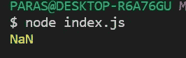

# JavaScript 编号 NaN 属性

> 原文:[https://www . geesforgeks . org/JavaScript-number-nan-property/](https://www.geeksforgeeks.org/javascript-number-nan-property/)

在 JavaScript 中， **NaN** 代表**N**ot**a**T6】N 袅。它代表一个不是有效数字的值。它可用于检查输入的数字是否为有效数字。要将变量赋给 NaN 值，我们可以使用以下两种方法之一。

```
var a = NaN
```

```
var a = Number.NaN
```

**示例:**在本例中，我们将使用 JavaScript Number NaN Property。

```
var monthNumber = 14;

if (monthNumber < 1 || monthNumber > 12) {

    // Assigning monthNumber NaN as 
    // month number is not valid
    monthNumber = Number.NaN;

    console.log("Month number should be"
                + " between 1 and 12");
}
else {
    console.log(monthNumber);
}
```

**输出:**


**我们将看到一些返回 NaN 的操作示例。**

**示例 1:** 每当我们试图将字符串或“未定义”解析为 int 时，它都会返回 NaN。

```
console.log(parseInt("higeeks"));
```

**输出:**



**例 2:** 每当我们试图用 **Math.sqrt** 函数求一个负数的平方根时，它都会返回 NaN。

```
console.log(Math.sqrt(-1));
```

**输出:**


**例 3:** 每当我们试图对 NaN 进行 on 运算时，它都会返回 NaN。

```
console.log(5 + NaN);
```

**输出:**


**例 4:** 任何不定形也返回 NaN。

```
console.log(0 * Infinity)
```

**输出:**


**例 5:** 除了对字符串进行加法以外的任何操作都会产生 NaN。

```
console.log("hi"/5)
```

**输出:**

