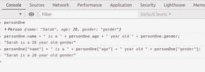

# JavaScript 对象初始化器

> 原文:[https://www . geesforgeks . org/JavaScript-object-initializer/](https://www.geeksforgeeks.org/javascript-object-initializer/)

[**JavaScript 中的对象**](https://www.geeksforgeeks.org/objects-in-javascript/) 可以和现实中的对象进行对比。它们有附加的属性和方法，并且属性是键值对的形式。让我们用一个例子来理解这一点。在现实世界中，摩托车是一个物体，它有名称、颜色、价格等属性。它附带了一些方法，如启动、制动、停止等。所有的摩托车将有相似的属性，但价值会有所不同。同样的概念也应用在编程中，被称为 [**面向对象编程**](https://www.geeksforgeeks.org/introduction-object-oriented-programming-javascript/) 。

JavaScript 对象可以通过如下各种方式进行初始化。

1.  使用对象文字
2.  使用新的对象()方法
3.  使用对象创建()方法
4.  使用构造函数

让我们了解所有方法–

**使用对象文字:**
**语法:**

```
var obj = { name: "value", .... }
```

JavaScript 对象的属性可以使用点符号或括号符号来访问。例如， *obj.name* 或*obj【‘name’】*会给我们这个值。

**示例:**

## java 描述语言

```
var person = {
  name: "Sarah",
  age: 20,
  gender: "female"
};
console.log(person);
console.log(person.name + " is a " + person.age + "
           year old " + person.gender);
console.log(person.name + " is a " + person.age + "
           year old " + person["gender"]);
```

**输出:**


**使用新的 Object()方法:**

**语法:**

```
var obj = new Object();
    obj.name = "value";
```

或者

```
obj["name"] = "value";
```

*新对象()*方法将创建一个新的 JavaScript 对象，其属性可以使用点或括号符号进行初始化。

**示例:**

## java 描述语言

```
var Person = new Object();
Person.name = "Sarah";
Person['age'] = 20;
Person.gender = "female";

console.log(Person);
console.log(Person.name + " is a " + Person.age +
           " year old " + Person.gender);
console.log(Person.name + " is a " + Person.age +
          " year old " + Person["gender"]);
```

**输出:**


**使用 Object.create()方法:**

**语法:**

```
var Obj = Object.create({});
Obj.name = "value";
```

或者

```
Obj["name"] = "value";
```

*Object.create()* 方法将创建一个新的 JavaScript 对象，其属性可以使用点或括号符号进行初始化。

**示例:**

## java 描述语言

```
var Person = Object.create({})
Person.name = "Sarah";
Person["age"] = 20;
Person.gender = "female";

console.log(Person);
console.log(Person.name + " is a " + Person.age +
           " year old " + Person.gender);
console.log(Person.name + " is a " + Person.age +
          " year old " + Person["gender"]);
```

**输出:**


**使用构造函数:**

**语法:**

```
function Obj(name) {
   this.name = name;
 }
 var myobj = new Obj("my name");
```

在该方法中，构造函数用于定义对象， [*这个*](https://www.geeksforgeeks.org/this-in-javascript/) 用于给属性赋值。使用*新的*关键字创建对象的实例。

**示例:**

## java 描述语言

```
function Person(name, age, gender) {
    this.name = name;
    this.age = age;
    this.gender = gender;
 }

 var personOne = new Person("Sarah", 20, "gender");

console.log(personOne);
console.log(personOne.name + " is a " + personOne.age +
            " year old " + personOne.gender);
console.log(personOne.name + " is a " + personOne.age +
            " year old " + personOne["gender"]);
```

**输出:**



**支持的浏览器:**

*   Chrome 1 及以上
*   边缘 12 及以上
*   Firefox 1 及以上版本
*   Internet Explorer 1 及以上版本
*   歌剧 4 及以上
*   Safari 1 及以上