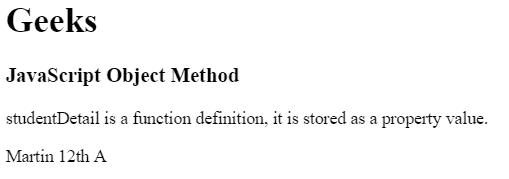
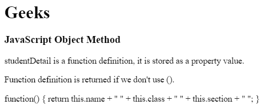
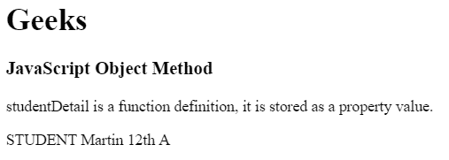

# JavaScript |对象方法

> 原文:[https://www.geeksforgeeks.org/javascript-object-methods/](https://www.geeksforgeeks.org/javascript-object-methods/)

JavaScript 中的对象方法可以通过函数来访问。JavaScript 中的函数存储为属性值。也可以在不使用括号()的情况下调用对象。

*   在方法中，“this”指的是所有者对象。
*   附加信息也可以随对象方法一起添加。

**语法:**

```
objectName.methodName()
```

**属性:**一个函数可以划分为不同的属性值，然后将这些属性值组合在一起返回。
例如:学生函数包含属性:

*   名字
*   班级
*   部分

**返回值:**返回作为对象属性存储的方法/函数。
**示例 1:** 本示例使用函数定义作为属性值。

## 超文本标记语言

```
<!DOCTYPE html>
<html>

<head>
    <title>
        JavaScript Object Methods
    </title>
</head>

<body>
    <h1>Geeks</h1>

    <h3>JavaScript Object Method</h3>

<p>
        studentDetail is a function definition,
        it is stored as a property value.
    </p>

    <p id="gfg"></p>

    <script>

        // Object creation
        var student = {
            name: "Martin",
            class : "12th",
            section : "A",

            studentDetails : function() {
                return this.name + " " + this.class
                    + " " + this.section + " ";
            }
        };

        // Display object data
        document.getElementById("gfg").innerHTML
                = student.studentDetails();
    </script>
</body>

</html>                               
```

**输出:**



**示例 2:** 该示例使用存储属性值和不带括号()的访问。

## 超文本标记语言

```
<!DOCTYPE html>
<html>

<head>
    <title>
        JavaScript Object Methods
    </title>
</head>

<body>
    <h1>Geeks</h1>

    <h3>JavaScript Object Method</h3>

<p>
        studentDetail is a function definition,
        it is stored as a property value.
    </p>

<p>
        Function definition is returned
        if we don't use ().
    </p>

    <p id="gfg"></p>

    <script>

        // Object creation
        var student = {
            name: "Martin",
            class : "12th",
            section : "A",

            studentDetails : function() {
                return this.name + " " + this.class
                    + " " + this.section + " ";
            }
        };

        // Display object data
        document.getElementById("gfg").innerHTML
                = student.studentDetails;
    </script>
</body>

</html>                               
```

**输出:**



**示例 3:** 使用函数定义作为属性值并访问附加详细信息。

## 超文本标记语言

```
<!DOCTYPE html>
<html>

<head>
    <title>
        JavaScript Object Methods
    </title>
</head>

<body>
    <h1>Geeks</h1>

    <h3>JavaScript Object Method</h3>

<p>
        studentDetail is a function definition,
        it is stored as a property value.
    </p>

    <p id="gfg"></p>

    <script>

        // Object creation
        var student = {
        name: "Martin",
        class : "12th",
        section : "A",

        studentDetails : function() {
            return this.name + " " + this.class
                + " " + this.section + " ";
        }
    };

    // Display object data
    document.getElementById("gfg").innerHTML
        = "STUDENT " + student.studentDetails();
    </script>
</body>

</html>                                   
```

**输出:**



**支持的浏览器:**

*   谷歌 Chrome
*   微软边缘
*   火狐浏览器
*   狩猎