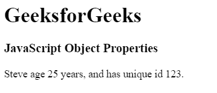
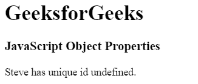
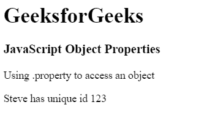
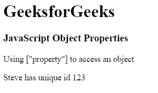
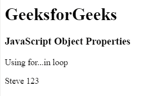

# JavaScript |对象属性

> 原文:[https://www.geeksforgeeks.org/javascript-object-properties/](https://www.geeksforgeeks.org/javascript-object-properties/)

对象属性被定义为名称和值之间的简单关联。所有属性都有一个名称，值是与属性链接的属性之一，它定义了授予属性的访问权限。属性是指与 JavaScript 对象相关联的值的集合。该集合可能不遵循任何特定顺序。JavaScript 提供了添加、删除和修改属性的功能。属性由名称表示:值对。

**语法:**

*   ```
    objectName.property 
    ```

*   ```
    objectName["property"]
    ```

*   ```
    objectName[expression]
    ```

**属性:**

*   **添加:**它可以通过简单地给那些新对象赋予值来添加新对象。
*   **删除:**使用 delete 关键字，从对象中删除属性。

**示例 1:** 显示向现有对象添加新属性。

```
<!DOCTYPE html>
<html>

<head>
    <title>
        JavaScript Object Properties
    </title>
</head>

<body>
    <h1>Geeks</h1>

    <h3>JavaScript Object Properties</h3>

    <p id="gfg"></p>

    <!-- Script to add object property -->
    <script>
        var employee = {
            name:"Steve",
            id:"123"
        };

        employee.age="25";

        document.getElementById("gfg").innerHTML = employee.name
            + " age " + employee.age + " years, and has unique id "
            + employee.id +".";
    </script>
</body>

</html>                                
```

**输出:**


**示例 2:** 显示从现有对象中删除属性。

```
<!DOCTYPE html>
<html>

<head>
    <title>
        JavaScript Object Properties
    </title>
</head>

<body>
    <h1>Geeks</h1>

    <h3>JavaScript Object Properties</h3>

    <p id="gfg"></p>

    <!-- Script to delete object content -->
    <script>
        var employee = {
            name:"Steve",
            id:"123"
        };

        /* Delete employee id */
        delete employee.id;
        document.getElementById("gfg").innerHTML = employee.name
                + " has unique id " + employee.id +"." ;
    </script>
</body>

</html>                    
```

**输出:**


访问对象属性有不同的方法。以下示例演示了不同的访问技术:

*   **Example:** This example uses .property to access object element.

    ```
    <!DOCTYPE html>
    <html>

    <head>
        <title>
            JavaScript Object Properties
        </title>
    </head>

    <body>
        <h1>Geeks</h1>

        <h3>JavaScript Object Properties</h3>

        <p>Using .property to access an object</p>

        <p id="gfg"></p>

        <script>
            var employee = {
                name:"Steve",
                id:"123"
            };

            document.getElementById("gfg").innerHTML = employee.name
                    + " has unique id " + employee.id ;
        </script>
    </body>

    </html>                    
    ```

    **输出:**
    

*   **Example:** This example uses [“property”] to access the object element.

    ```
    <!DOCTYPE html>
    <html>

    <head>
        <title>
            JavaScript Object Properties
        </title>
    </head>

    <body>
        <h1>GeeksforGeeks</h1>

        <h3>JavaScript Object Properties</h3>

        <p>Using ["property"] to access an object</p>

        <p id="gfg"></p>

        <!-- Script to access an object -->
        <script>
            var employee = {
                name:"Steve",
                id:"123"
            };

            document.getElementById("gfg").innerHTML = employee["name"]
                    + " has unique id " + employee["id"] ;
        </script>
    </body>

    </html>                    
    ```

    **输出:**
    

*   **Example:** This example uses for…in loop to access the object element.

    ```
    <!DOCTYPE html>
    <html>

    <head>
        <title>
            JavaScript Object Properties
        </title>
    </head>

    <body>
        <h1>GeeksforGeeks</h1>

        <h3>JavaScript Object Properties</h3>

        <p>Using for...in loop</p>

        <p id="GFG"></p>

        <!-- Script to use loop to access object content -->
        <script>
            var gfg = "";
            var employee = {
                name:"Steve",
                id:"123"
            };

            var z;
            for (z in employee) {
                gfg += employee[z] + " ";
            }
            document.getElementById("GFG").innerHTML = gfg;
        </script>
    </body>

    </html>                    
    ```

    **输出:**
    