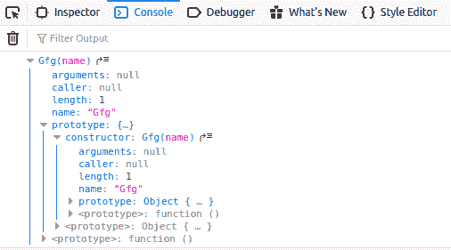
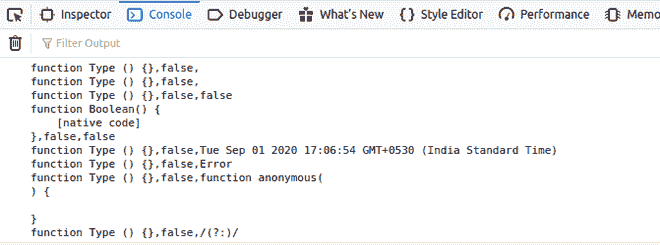

# JavaScript 对象.原型.构造函数属性

> 原文:[https://www . geesforgeks . org/JavaScript-object-prototype-constructor-property/](https://www.geeksforgeeks.org/javascript-object-prototype-constructor-property/)

cont constructor 属性返回对已创建对象实例的对象构造函数的引用。构造函数的值不是包含函数名称的字符串，而是对函数本身的引用。

**语法:**

```
Object.constructor
```

**返回值:**是对构造函数对象的引用。

**示例 1:** 下面的示例说明了如何显示对象的构造函数。

## 超文本标记语言

```
<!DOCTYPE html>
<html>

<body>
    <script type="text/javascript">
        function Gfg(name) {
            this.name = name
        }
        let GeeksforGeeks = new Gfg('Geeks');
        console.log(GeeksforGeeks.constructor);
    </script>
</body>

</html>
```

**输出:**



**示例 2:** 下面的示例说明了如何更改对象的构造函数。

## 超文本标记语言

```
<!DOCTYPE html>
<html>

<body>
    <script type="text/javascript">
        function Types() { }
        let types = [
            new Array(),
            [],
            new Boolean(),
            false,
            new Date(),
            new Error(),
            new Function(),
            new RegExp(),
            /(?:)/
        ]
        let j = 0;
        while (j < types.length) {
            types[j].constructor = Types
            types[j] = [types[j].constructor,
            types[j] instanceof Types,
            types[j].toString()]
            ++j;
        }
        console.log(types.join('\n'));
    </script>
</body>

</html>
```

**输出:**



**支持的浏览器:**

*   Chrome 1 及以上
*   边缘 12 及以上
*   Firefox 1 及以上版本
*   Internet Explorer 11 及以上版本
*   Opera 9.5 及以上
*   Safari 3 及以上版本