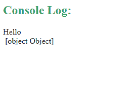
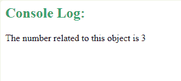
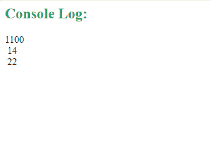

# JavaScript object . prototype . tostring()方法

> 原文:[https://www . geesforgeks . org/JavaScript-object-prototype-tostring-method/](https://www.geeksforgeeks.org/javascript-object-prototype-tostring-method/)

在 JavaScript 中， **Object.prototype.toString()方法**用来返回一个可以表示对象的字符串。toString()方法被从对象继承的每个对象自动继承。每当要将对象表示为文本值或期望从对象中得到字符串时，都会自动调用 toString()方法。

#### 语法:

```
obj.toString()
```

如果在自定义对象的情况下不重写 toString()方法，toString()方法将返回以下内容:

```
[object type] 
```

在上面的语法中，类型表示对象类型。

toString()方法的另一个用途是，它可以用来将基数为 10 的数字(甚至是 bigInts)转换为其他基数。

**语法:**

```
ExNum.toString(radix);
```

在上面的语法中，ExNum 是一个对象类型数字或 bigInt 的对象，而基数是指数字要转换成的基数。

**示例 1:** 以下示例显示了当 toString()方法未被重写时，toString()方法在处理默认对象类型和自定义对象类型时的工作方式。

## Java Script 语言

```
<script>

    // Creating a custom object type
    function ExObjType(n) {
        this.number = n;
    }

    function myFunction() {

        // Creating an object of the
        // String class
        const o = new String('Hello');
        console.log(o.toString());

        // Creating an object ExObj1 of
        // custom defined class  
        const ExObj1 = new ExObjType(3);

        // Returns [object Object] as toString()
        // not overridden for custom class
        console.log(ExObj1.toString());
    }
    myFunction();
</script>
```

**输出:**



**示例 2:** 以下示例显示了在处理自定义对象类型时 toString()方法是如何工作的，并且 toString()方法被覆盖:

## Java Script 语言

```
<script>

    // Creating a custom object type
    function ExObjType(n) {
        this.number = n;
    }

    // Overriding the toString() method
    // for ExObjectType
    ExObjType.prototype.toString = function ExObjToString() {
        const ans = 'The number related to this object is '
                 + this.number;
        return ans;
    }

    function myFunction() {

        // Creating an object ExObj1 of 
        // custom defined class  
        const ExObj1 = new ExObjType(3);

        // Calling the toString() method
        // after overriding
        console.log(ExObj1.toString());
    }
    myFunction();
</script>
```

**输出:**



**示例 3:** 下面的示例展示了如何使用 toString()方法将基数为 10 的数字转换为不同的基数。

## Java Script 语言

```
<script>
    function myFunction() {

        // Creating a constant num1
        // with value 12
        const num1 = 12;

        // Converts num1 to a binary form
        console.log(num1.toString(2));

        // Converts num1 to its octal form
        console.log(num1.toString(8));

        // Converts num1 to its base-5 form
        console.log(num1.toString(5));
    }
    myFunction();
</script>
```

**输出:**

