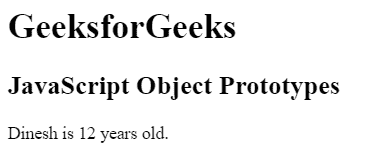
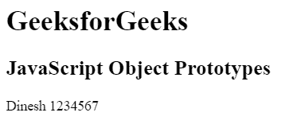

# JavaScript |对象原型

> 原文:[https://www.geeksforgeeks.org/javascript-object-prototypes/](https://www.geeksforgeeks.org/javascript-object-prototypes/)

JavaScript 原型用于访问对象的属性和方法。继承的属性最初在原型或父对象中定义。日期对象继承自日期原型，数组对象继承自数组原型等。原型可用于向现有对象和对象构造函数添加新的属性和方法。

**语法:**

```
Object.prototype
```

**示例 1:** 本示例向对象添加新属性。

```
<!DOCTYPE html>
<html>

<head>
    <title>
        JavaScript Object Prototypes
    </title>
</head>

<body>
    <h1>GeeksforGeeks</h1>

    <h2>JavaScript Object Prototypes</h2>

    <p id="GFG"></p>

    <script>
        function Student(a, b) {
            this.name = a;
            this.id = b;
        }

        Student.prototype.age = 12;

        var s1 = new Student("Dinesh", 1234567);

        document.getElementById("GFG").innerHTML = s1.name +
                " is " + s1.age + " years old."; 
    </script>
</body>

</html>                    
```

**输出:**


**示例 2:** 本示例向对象添加新方法。

```
<!DOCTYPE html>
<html>

<head>
    <title>
        JavaScript Object Prototypes
    </title>
</head>

<body>
    <h1>GeeksforGeeks</h1>

    <h2>JavaScript Object Prototypes</h2>

    <p id="GFG"></p>

    <!-- Script to add new method -->
    <script>
        function Student(a, b) {
            this.name = a;
            this.id = b;
        }

        Student.prototype.details = function() {
            return this.name + " " + this.id
        };

        var s1 = new Student("Dinesh", 1234567);

        document.getElementById("GFG").innerHTML
                = s1.details(); 
    </script>
</body>

</html>                    
```

**输出:**
