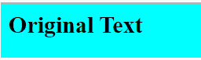
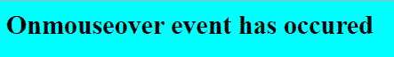
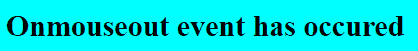
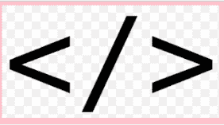
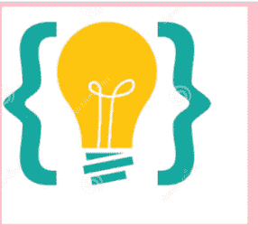

# JavaScript onmouse 事件

> 原文:[https://www.geeksforgeeks.org/javascript-onmouse-events/](https://www.geeksforgeeks.org/javascript-onmouse-events/)

鼠标上的**事件用于定义使用鼠标的操作。**

**JavaScript 中的 onmouse 事件有:**

*   **[onmouseover](https://www.geeksforgeeks.org/html-onmouseover-event-attribute/) 和 [onmouseout](https://www.geeksforgeeks.org/html-onmouseout-event-attribute/)**
*   **[上木素普](https://www.geeksforgeeks.org/html-onmouseup-event-attribute/)和[上木素城](https://www.geeksforgeeks.org/html-onmousedown-attribute/)**
*   **onmouseenter 和 onmouseleave**

1.  ****onmouseover 和 onmouseout:****

    **当鼠标光标放在特定元素上时，会发生 onmouseover 和 onmouseout 事件**

     **这些事件不需要鼠标点击就能发生

    ```
    <html>
      <head>
        <script type="text/javascript">
         function over()
          {
            document.getElementById('key').innerHTML=
    "Onmouseover event has occured";
          }
          function out()
          {
            document.getElementById('key').innerHTML=
    "Onmouseout event has occured";
          }
        </script>
      </head>
      <body bgcolor="cyan">
        <h2 id="key" onmouseover="over()" 
                     onmouseout="out()">
           Original Text</h2>
      </body>
    </html>
    ```

    **输出:**

    加载网页时:

    

    将鼠标放在元素上后:

    

    从元素中移除鼠标后:

    ** 
2.  ****onmouseup 和 onmousedown:****

     **当遇到鼠标点击时，会发生这些事件

    ```
    <html>
      <head> 
         <script type="text/javascript">
          function up()
           {
             document.getElementById("img").src="up.png";
           }
          function down()
           {
             document.getElementById("img").src = "down.png";
           }
         </script>
      </head>
      <body bgcolor='yellow'>
        
      </body>
    </html>
    ```

    **输出:**

    加载网页时:

    

    onmousedown 事件的发生:

    

    onmouseup 事件的发生:

    ** 
3.  ****on mouse net 和 on mouse elevate****

    **当鼠标放在元素上并停留直到鼠标从元素中移除时，onmouseenter 事件发生**

    **当鼠标从元素中移除时，onmouseleave 事件就会发生**

     **这些事件不需要鼠标点击就能发生

    ```
    <html>
      <head> 
        <script type="text/javascript">
          function enter()
           {
             document.getElementById(
    "img").src="enter.png";
           }
          function leave()
          {
            document.getElementById(
    "img").src = "leave.png";
           }
        </script>
      </head>
       <body bgcolor='yellow'>
         
       </body>
    </html>
    ```

    **输出:**

    加载网页时:

    

    onmouseenter 事件的发生:

    

    onmouseleave 事件的发生:

    **