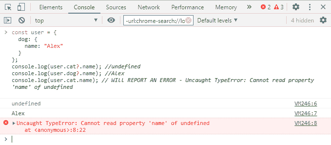
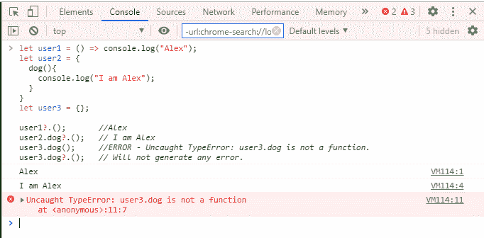

# JavaScript |可选链接

> 原文:[https://www.geeksforgeeks.org/javascript-optional-chaining/](https://www.geeksforgeeks.org/javascript-optional-chaining/)

**可选链接？.'**是访问嵌套对象属性的防错方式，即使中间属性不存在。它最近由 ECMA 国际，技术委员会 39-ECMAscript 推出，作者是克劳德·帕奇、加布里埃尔·伊森伯格、丹尼尔·罗森瓦瑟、达斯汀·萨维里。它的工作原理类似于链接“.”只是它不报告错误，而是返回一个未定义的值。当我们试图调用一个可能不存在的方法时，它也与函数调用一起工作。

当我们想要检查深藏在树状结构中的属性值时，我们经常需要检查中间节点是否存在。

```
let Value = user.dog && user.dog.name;
```

可选的链接操作符允许开发人员处理许多这样的情况，而不用重复它们自己和/或在临时变量中分配中间结果:

```
let Value = user.dog?.name;
```

**语法:**

```
obj?.prop
obj?.[expr]
arr?.[index]
func?.(args)
```

**注意:**如果这段代码出现任何错误，请尝试在在线 JavaScript 编辑器上运行。

**示例:**与对象的可选链接

## java 描述语言

```
const user = {
  dog: {
    name: "Alex"
  }
};

console.log(user.cat?.name); //undefined
console.log(user.dog?.name); //Alex
console.log(user.cat.name);
```

**输出:**



**示例:**带函数调用的可选链接

## java 描述语言

```
let user1 = () => console.log("Alex");
let user2 = {
  dog(){
    console.log("I am Alex");
  }
}
let user3 = {};

user1?.();       // Alex
user2.dog?.();   // I am Alex
user3.dog();     // ERROR - Uncaught TypeError:
                 // user3.dog is not a function.
user3.dog?.();   // Will not generate any error.
```

**输出:**

