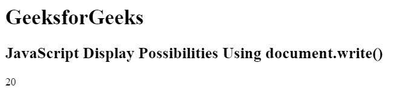
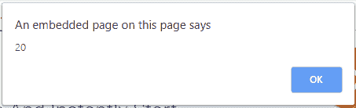
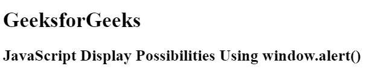
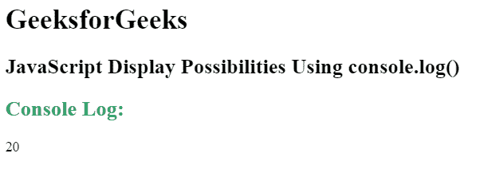

# JavaScript |输出

> 原文:[https://www.geeksforgeeks.org/javascript-output/](https://www.geeksforgeeks.org/javascript-output/)

JavaScript 输出定义了显示给定代码输出的方式。输出可以通过以下列出的四种不同方式显示:

*   **innerHTML:** It is used to access an element. It defines the HTML content.

    **语法:**

    ```
    document.getElementById(id)
    ```

    **示例:**本示例使用 innerHTML 显示数据。

    ```
    <!DOCTYPE html>
    <html>

    <head>
        <title>
            JavaScript Output using innerHTML
        </title>
    </head>

    <body>
        <h1>GeeksforGeeks</h1>

        <h2>
            JavaScript Display Possibilities
            Using innerHTML
        </h2>

        <p id="GFG"></p>

        <!-- Script to uses innerHTML -->
        <script>
            document.getElementById("GFG").innerHTML
                    = 10 * 2;
        </script>
    </body>

    </html>                    
    ```

    **输出:**
    

*   **document.write():** It is used for testing purpose.

    **语法:**

    ```
    document.write()
    ```

    **示例:**本示例使用 document.write()属性显示数据。

    ```
    <!DOCTYPE html>
    <html>

    <head>
        <title>
            JavaScript Output using document.write()
        </title>
    </head>

    <body>
        <h1>GeeksforGeeks</h1>

        <h2>
            JavaScript Display Possibilities
            Using document.write()
        </h2>

        <p id="GFG"></p>

        <!-- Script to uses document.write() -->
        <script>
            document.write(10 * 2);
        </script>
    </body>

    </html>                    
    ```

    **输出:**
    

*   **window.alert():**It displays the content using an alert box.

    **语法:**

    ```
    window.alert()
    ```

    **示例:**本示例使用 window.alert()属性显示数据。

    ```
    <!DOCTYPE html>
    <html>

    <head>
        <title>
            JavaScript Output using window.alert()
        </title>
    </head>

    <body>
        <h1>GeeksforGeeks</h1>

        <h2>
            JavaScript Display Possibilities
            Using window.alert()
        </h2>

        <p id="GFG"></p>

        <!-- Script to use window.alert() -->
        <script>
            window.alert(10 * 2);
        </script>
    </body>

    </html>                    
    ```

    **输出:**
    
    

*   **console.log():** It is used for debugging purposes.

    **语法:**

    ```
    console.log()
    ```

    **示例:**本示例使用 console.log()属性显示数据。

    ```
    <!DOCTYPE html>
    <html>

    <head>
        <title>
            JavaScript Output using innerHTML
        </title>
    </head>

    <body>
        <h1>GeeksforGeeks</h1>

        <h2>
            JavaScript Display Possibilities
            Using console.log()
        </h2>

        <p id="GFG"></p>

        <!-- Script to use console.log() -->
        <script>
            console.log(10*2);
        </script>
    </body>

    </html>                    
    ```

    **输出:**
    