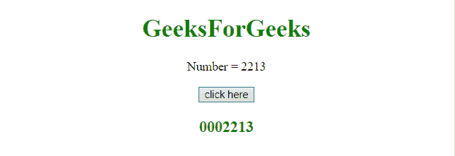
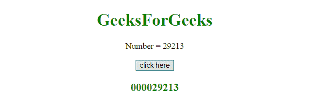

# JavaScript |用前导零填充数字

> 原文:[https://www . geesforgeks . org/JavaScript-pad-一个带前导零的数字/](https://www.geeksforgeeks.org/javascript-pad-a-number-with-leading-zeros/)

**字符串原型属性**用于用前导零填充数字。此属性允许向现有对象类型添加新的属性和方法。

**语法:**

```
object.prototype.name = value
```

**返回值:**返回对 String.prototype 对象的引用。

**示例 1:** 本示例通过创建一个函数向一个数字添加前导零，在该函数中，如果该数字小于所提供的宽度，则添加前导零。

```
<!DOCTYPE html> 
<html> 
    <head> 
        <title> 
            JavaScript | Pad a number with leading zeros
        </title>
    </head> 

    <body style = "text-align:center;" id = "body"> 

        <h1 style = "color:green;" > 
            GeeksForGeeks 
        </h1> 

        <p id = "GFG_UP" style = "font-size: 16px;"></p>

        <button onclick = "gfg_Run()"> 
            click here
        </button>

        <p id = "GFG_DOWN" style = "color:green;
                    font-size: 20px; font-weight: bold;">
        </p>

        <script>
            var el_up = document.getElementById("GFG_UP");
            var el_down = document.getElementById("GFG_DOWN");
            var num = 2213;
            el_up.innerHTML = 'Number = ' +num;
            function pad(n, width) {
                n = n + '';
                return n.length >= width ? n : 
                    new Array(width - n.length + 1).join('0') + n;
            }
            function gfg_Run() {                 
                el_down.innerHTML = pad(num, 7); 
            } 
        </script> 
    </body> 
</html>                    
```

**输出:**

*   **点击按钮前:**
    
*   **点击按钮后:**
    

**示例 2:** 本示例通过创建原型 **pad** 将前导零添加到数字中。在这个例子中，我们可以向对象传递一个字符串，无论我们想用数字填充什么。

```
<!DOCTYPE html> 
<html> 
    <head> 
        <title> 
            JavaScript | Pad a number with leading zeros
        </title>
    </head> 

    <body style = "text-align:center;" id = "body"> 

        <h1 style = "color:green;" > 
            GeeksForGeeks 
        </h1> 

        <p id = "GFG_UP" style = "font-size: 16px;"></p>

        <button onclick = "gfg_Run()"> 
            click here
        </button>

        <p id = "GFG_DOWN" style = "color:green; 
                font-size: 20px; font-weight: bold;">
        </p>

        <script>
            var el_up = document.getElementById("GFG_UP");
            var el_down = document.getElementById("GFG_DOWN");
            var num = '29213';
            el_up.innerHTML = 'Number = ' + num;

            String.prototype.pad = function(String, len) {
                var str = this;
                while (str.length < len)
                    str = String + str;
                return str;
            }
            function gfg_Run() {                 
                el_down.innerHTML = num.pad("0", 9); 
            } 
        </script> 
    </body> 
</html>                    
```

**输出:**

*   **点击按钮前:**
    
*   **点击按钮后:**
    