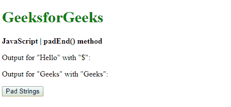
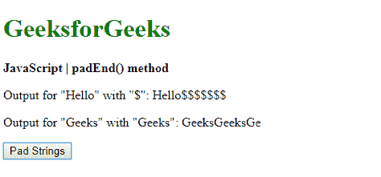
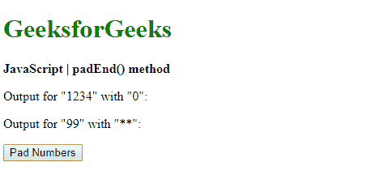
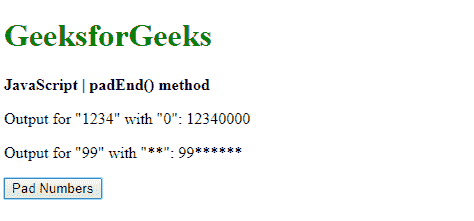

# JavaScript | padEnd()方法

> 原文:[https://www.geeksforgeeks.org/javascript-padend-method/](https://www.geeksforgeeks.org/javascript-padend-method/)

JavaScript 中的 **padEnd()** 方法是用另一个字符串填充一个字符串，直到它达到给定的长度。填充从字符串的右端开始应用。

**语法:**

```
string.padEnd( targetLength, padString )
```

**参数:**该方法接受两个参数，如上所述，如下所述:

*   **targetLength:** 是原始字符串被填充后最终字符串的长度。如果该值小于原始字符串长度，则返回原始字符串。
*   **padString:** 是要用原弦填充的弦。如果该值太长而不在目标长度范围内，则会被截断。

**返回值:**返回用给定长度的给定字符串填充的最终字符串。

**示例 1:** 本示例使用 padEnd()方法将字符串填充到另一个字符串中。

```
<!DOCTYPE html>
<html>

<head>
    <title>
        JavaScript | padEnd() method
    </title>
</head>

<body>
    <h1 style="color: green">
        GeeksforGeeks
    </h1>

    <b>
        JavaScript | padEnd() method
    </b>

    <p>
        Output for "Hello" with "{content}quot;: 
        <span class="output"></span>
    </p>

    <p>
        Output for "Geeks" with "Geeks": 
        <span class="output2"></span>
    </p>

    <button onclick="padStrings()">
        Pad Strings
    </button>

    <script type="text/javascript">

        function padStrings() {
            exString = "Hello";
            exString2 = "Geeks";

            output = 
                exString.padEnd(12, "{content}quot;);
            output2 = 
                exString2.padEnd(12, "Geeks");

            document.querySelector('.output').textContent
                    = output;

            document.querySelector('.output2').textContent
                    = output2;
        }
    </script>
</body>

</html>
```

**输出:**

*   **点击按钮前:**
    
*   **点击按钮后:**
    

**示例 2:** 本示例使用 padEnd()方法将数字填充到另一个数字中。

```
<!DOCTYPE html>
<html>

<head>
    <title>
        JavaScript | padEnd() method
    </title>
</head>

<body>
    <h1 style="color: green">
        GeeksforGeeks
    </h1>

    <b>
        JavaScript | padEnd() method
    </b>

    <p>
        Output for "1234" with "0": 
        <span class="output"></span>
    </p>

    <p>
        Output for "99" with "**": 
        <span class="output2"></span>
    </p>

    <button onclick="padNumbers()">
        Pad Numbers
    </button>

    <script type="text/javascript">
        function padNumbers() {
            exNumber = 1234;
            exNumber2 = 99;

            output = 
                String(exNumber).padEnd(8, "0");

            output2 = 
                String(exNumber2).padEnd(8, "**");

            document.querySelector('.output').textContent
                    = output;

            document.querySelector('.output2').textContent
                    = output2;
        }
    </script>
</body>

</html>
```

**输出:**

*   **点击按钮前:**
    
*   **点击按钮后:**
    

**支持的浏览器:**下面列出了 *padEnd()* 方法支持的浏览器:

*   谷歌 Chrome 57
*   Firefox 48
*   边缘 15
*   Safari 10
*   歌剧 44