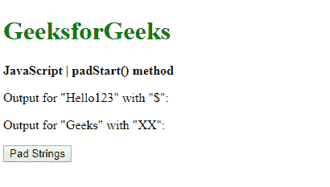
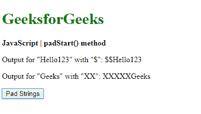
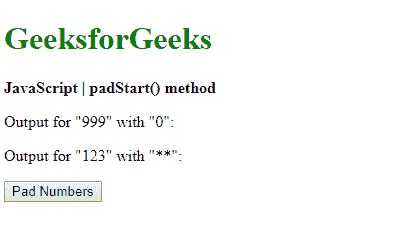
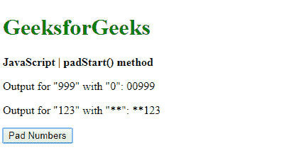

# JavaScript | padStart()方法

> 原文:[https://www.geeksforgeeks.org/javascript-padstart-method/](https://www.geeksforgeeks.org/javascript-padstart-method/)

JavaScript 中的 **padStart()** 方法是用另一个字符串填充一个字符串，直到它达到给定的长度。填充从字符串的左端应用。

**语法:**

```
string.padStart(targetLength, padString)
```

**参数:**该方法接受两个参数，如上所述，如下所述:

*   **targetLength:** 是原始字符串被填充后最终字符串的长度。如果该值小于原始字符串长度，则返回原始字符串。
*   **padString:** 是要用原弦填充的弦。如果该值太长，不在目标长度范围内，则从末尾截断。默认使用的字符串是空格字符(" ")。

**返回值:**返回用给定字符串填充到给定长度的最后一个字符串。

**示例 1:** 本示例使用 padStart()方法将字符串填充到另一个字符串中。

```
<!DOCTYPE html>
<html>

<head>
    <title>
        JavaScript | padStart() method
    </title>
</head>

<body>
    <h1 style="color: green">
        GeeksforGeeks
    </h1>

    <b>JavaScript | padStart() method</b>

    <p>Output for "Hello123" with "{content}quot;: 
        <span class="output"></span>
    </p>

    <p>Output for "Geeks" with "XX": 
        <span class="output_2"></span>
    </p>

    <button onclick="padStrings()">
        Pad Strings
    </button>

    <script type="text/javascript">
        function padStrings() {
            exString = "Hello123";
            exString2 = "Geeks";

            prepended_out = 
                exString.padStart(10, "{content}quot;);
            prepended_out2 = 
                exString2.padStart(10, "XX");

            document.querySelector('.output').textContent
                        = prepended_out;

            document.querySelector('.output_2').textContent
                        = prepended_out2;
        }
    </script>
</body>

</html>
```

**输出:**

*   **点击按钮前:**
    
*   **点击按钮后:**
    

**示例 2:** 本示例使用 padStart()方法将数字填充到另一个数字中。

```
<!DOCTYPE html>
<html>

<head>
    <title>
        JavaScript | padStart() method
    </title>
</head>

<body>
    <h1 style="color: green">
        GeeksforGeeks
    </h1>

    <b>JavaScript | padStart() method</b>

    <p>Output for "999" with "0": 
        <span class="output"></span>
    </p>

    <p>Output for "123" with "**": 
        <span class="output_2"></span>
    </p>

    <button onclick="padNumbers()">
        Pad Numbers
    </button>

    <script type="text/javascript">
        function padNumbers() {
            exNumber = 999;
            exNumber2 = 123;

            prepended_out
                = String(exNumber).padStart(5, "0");

            prepended_out2
                = String(exNumber2).padStart(5, "**");

            document.querySelector('.output').textContent
                = prepended_out;

            document.querySelector('.output_2').textContent
                = prepended_out2;
        }
    </script>
</body>

</html>
```

**输出:**

*   **点击按钮前:**
    
*   **点击按钮后:**
    

**支持的浏览器:**下面列出了 *padStart()* 方法支持的浏览器:

*   谷歌 Chrome 57
*   Firefox 48
*   边缘 15
*   Safari 10
*   歌剧 44