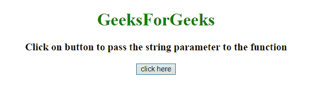
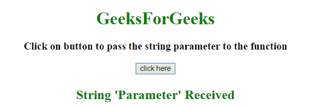

# JavaScript |在 onClick 函数中传递字符串参数

> 原文:[https://www . geesforgeks . org/JavaScript-pass-string-parameter-in-onclick-function/](https://www.geeksforgeeks.org/javascript-pass-string-parameter-in-onclick-function/)

任务是使用 javascript 在 onClick 函数上传递一个字符串作为参数，我们将讨论一些技术。

**示例 1:** 本示例使用 **onClick()方法**简单地将字符串参数放在调用函数的按钮的 onClick 属性中，该函数使用字符串作为参数。

```
<!DOCTYPE HTML>
<html>

<head>
    <title>
        JavaScript 
      | Pass string parameter in onClick function.
    </title>
</head>

<body style="text-align:center;" 
      id="body">
    <h1 style="color:green;">  
            GeeksForGeeks  
        </h1>
    <p id="GFG_UP" 
       style="font-size: 19px; 
              font-weight: bold;">
    </p>
    <button onclick="GFG_Fun('Parameter'); ">
        click here
    </button>
    <p id="GFG_DOWN"
       style="color: green; 
              font-size: 24px;
              font-weight: bold;">
    </p>
    <script>
        var up = 
            document.getElementById('GFG_UP');
        var down = 
            document.getElementById('GFG_DOWN');
        up.innerHTML = 
          'Click on button to pass the '+
          'string parameter to the function';

        function GFG_Fun(parameter) {
            down.innerHTML = "String '" 
            + parameter + "' Received";
        }
    </script>
</body>

</html>
```

**输出:**

*   **点击按钮前:**
    
*   **点击按钮后:**
    

**示例 2:** 本示例简单地将字符串参数放在按钮的 onClick 属性中，该按钮使用 **onClick()方法**调用以字符串为参数的函数。这里输入按钮是动态创建的。此示例使用与上一个示例相同的方法。

```
<!DOCTYPE HTML>
<html>

<head>
    <title>
        JavaScript 
      | Pass string parameter in onClick function.
    </title>
</head>

<body style="text-align:center;" 
      id="body">
    <h1 style="color:green;">  
            GeeksForGeeks  
        </h1>
    <p id="GFG_UP"
       style="font-size: 19px; 
              font-weight: bold;">
    </p>
    <p id="GFG_DOWN"
       style="color: green; 
              font-size: 24px;
              font-weight: bold;">
    </p>
    <script>
        var up = document.getElementById('GFG_UP');
        var down = document.getElementById('GFG_DOWN');
        var inputEl = document.createElement('input');
        inputEl.type = 'button';
        inputEl.value = "Click here";
        inputEl.addEventListener('click', function() {
            GFG_Fun('Parameter');
        });
        document.body.insertBefore(inputEl, down);
        up.innerHTML = 
          'Click on button to pass the '+
          'string parameter to the function';

        function GFG_Fun(parameter) {
            down.innerHTML = "String '" +
              parameter + "' Received";
        }
    </script>
</body>

</html>
```

**输出:**

*   **点击按钮前:**
    
*   **点击按钮后:**
    