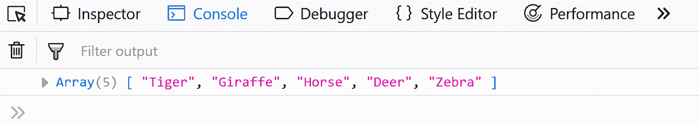
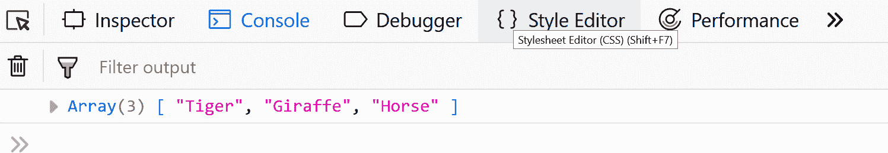

# JavaScript |性能

> 原文:[https://www.geeksforgeeks.org/javascript-performance/](https://www.geeksforgeeks.org/javascript-performance/)

**Javascript 中的性能**

JavaScript 几乎是每一个网络应用和基于网络的软件的重要组成部分。JavaScript 的客户端脚本功能可以使应用程序更加动态和交互式，但它也增加了代码低效的机会。因此，写得不好的 JavaScript 很难确保所有用户都有一致和健康的体验。

下面的指南将告诉您 JavaScript 性能问题的原因，并提供一些优化 JavaScript 代码的最佳实践。

**对 document.getElementById()使用快速 DOM 遍历。**
考虑到 jQuery 的可用性，基于标签名、类和 CSS3 的组合生成高度特定的选择器要容易得多。您需要注意的是，这种方法涉及多次迭代，而 jQuery 循环遍历每个 DOM 元素并试图找到匹配。您可以通过按标识挑选特定元素来提高 DOM 遍历速度。

**示例:**

```
// jQuery will need to iterate until it finds the right element
let button = jQuery('body div.dialog > div.close-button:nth-child(4)')[0];
```

上面的代码使用 JQuery 来操作 DOM，这不是最好的选择，因为我们可以使用文档对象提供的 getElementById 方法来代替这样做。

```
// A far more optimized way is to use document.getElementById.
let button = document.getElementById('dialog-close-button');
```

**延迟 JavaScript 加载**
我们加载样式表和 JavaScript 文件的地方会对页面的感知速度产生影响如果用户甚至在 JavaScript 接收之前就能看到一些内容这是一种更好的体验当浏览器遇到脚本标签时它会完全停止下载和运行脚本如果我们将脚本放在页面顶部这意味着它正在下载我们的 JavaScript 文件 这意味着当我们的脚本正在下载时，用户现在看不到任何内容。如果我们将脚本放在页面的底部，当我们的脚本开始加载时，页面上至少有一些内容，这使得页面加载得更快。

另一种方法是在脚本标记中使用 defer。delay 属性指定脚本应该在页面完成解析后执行，但它只适用于外部脚本。

**示例:**

```
// placing script at the end:
<html>
    <head>
        <title>My Page</title>
    </head>
    <body>
        <div id="user-greeting">Welcome back, user</div>
        <script type="text/javascript" src="my-script.js"></script>
    </body>
</html>

// using defer:
<script type="text/javascript" src="path/to/script2.js" defer></script>
```

**用“switch”代替冗长的“if-then-else”语句。**
当你的代码基数变大时，switch 语句通常比一组嵌套的 if 语句更有效。这是因为“switch”语句可以在编译期间更容易地进行优化。

**去掉不必要的循环和循环内的调用。**
数组 push() pop()和 shift()指令具有最小的处理开销，因为它们是与其低级汇编语言对应物密切相关的语言构造。

**示例:**

```
// push() method
    let Animals = ["Tiger", "Giraffe", "Horse", "Deer"];
    Animals.push("Zebra");
    console.log(Animals);
```



```
// pop() method
    let Animals = ["Tiger", "Giraffe", "Horse", "Deer"];
    Animals.pop();
    console.log(Animals);
```



```
// shift() method
    let Animals = ["Tiger", "Giraffe", "Horse", "Deer"];
    Animals.shift();
    console.log(Animals);
```


**尽可能减少代码量**
将应用程序的组件打包成*。js 文件并通过 JavaScript 缩小工具传递它们将使您的代码更加干净。有很多免费的代码缩减工具。

**使用局部作用域(' this')**
这对于使用回调编写异步代码特别有用，但是，它也提高了性能，因为您不依赖作用域链更高层的全局或闭包变量。您可以通过使用内置于每个函数中的特殊调用()和 apply()方法重新连接范围变量来充分利用它。请参见下面的示例:

**示例:**

```
let Organization = Object.create({
  init: function(name) {
     this.name = name;
  },
  do: function(callback) {
     callback.apply(this);
  }
});
let geeksforgeeks = new Organization('geeksforgeeks');
geeksforgeeks.do(function() {
    alert(this.name); // 'geeksforgeeks' gets alerted because we rewired 'this'.
});
```