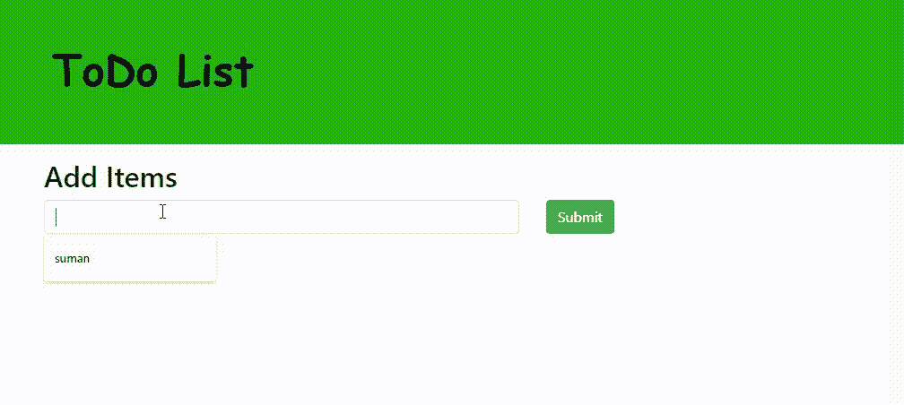

# 待办事项列表中的 JavaScript 项目

> 原文:[https://www . geesforgeks . org/JavaScript-待办事项项目/](https://www.geeksforgeeks.org/javascript-project-on-todo-list/)

**简介:** TODO List 是我们一般用来维护日常任务或必须做的所有事情的列表，最重要的任务在列表的顶部，最不重要的任务在底部。这有助于计划我们的日常日程。我们可以随时添加更多的任务，删除已经完成的任务。我们可以在待办事项列表中执行的四项主要任务是:

1.  添加任务
2.  更新任务
3.  阅读任务
4.  删除任务

**示例:**

## index.html

```html
<!DOCTYPE html>
<html lang="en">

<head>
    <meta charset="UTF-8">
    <meta name="viewport" content=
        "width=device-width, initial-scale=1.0">

    <link rel="stylesheet" href=
"https://stackpath.bootstrapcdn.com/bootstrap/4.3.1/css/bootstrap.min.css"
          integrity=
"sha384-ggOyR0iXCbMQv3Xipma34MD+dH/1fQ784/j6cY/iJTQUOhcWr7x9JvoRxT2MZw1T"
          crossorigin="anonymous">

    <script src="app.js"></script>

    <title>To Do List</title>
</head>

<body>
    <header class="bg-success text-white p-5">
        <div class="container">
            <div class="row">
                <div class="col-lg-12 col-md-12 col-sm-12">
                    <font face="Comic sans MS" 
                        size="11" color="black">
                        <strong>ToDo List</strong>
                    </font>

                </div>
            </div>
        </div>
    </header>

    <div class="container mt-3">
        <h2>Add Items</h2>

        <label id="lblsuccess" class="text-success" 
                style="display: none;">
        </label>

        <form id="addForm">
            <div class="row">
                <div class="col-lg-7 col-md-7 col-sm-7">

                    <input type="text" onkeyup=
                        "toggleButton(this, 'submit')"
                        class="form-control" id="item">
                </div>

                <div class="col-lg-5 col-md-5 col-sm-5">
                  <input type="submit" class="btn btn-dark"
                        id="submit" value="Submit" disabled>
                </div>
            </div>
        </form>

        <h3 class="mt-4">Tasks</h3>

        <form id="addForm">
            <ul class="list-group" id="items"></ul>
        </form>
    </div>
</body>

</html>
```

## app.js

```html
window.onload = () => {
    const form1 = document.querySelector("#addForm");

    let items = document.getElementById("items");
    let submit = document.getElementById("submit");

    let editItem = null;

    form1.addEventListener("submit", addItem);
    items.addEventListener("click", removeItem);
};

function addItem(e) {
    e.preventDefault();

    if (submit.value != "Submit") {
        console.log("Hello");

        editItem.target.parentNode.childNodes[0].data
            = document.getElementById("item").value;

        submit.value = "Submit";
        document.getElementById("item").value = "";

        document.getElementById("lblsuccess").innerHTML
            = "Text edited successfully";

        document.getElementById("lblsuccess")
                        .style.display = "block";

        setTimeout(function() {
            document.getElementById("lblsuccess")
                            .style.display = "none";
        }, 3000);

        return false;
    }

    let newItem = document.getElementById("item").value;
    if (newItem.trim() == "" || newItem.trim() == null)
        return false;
    else
        document.getElementById("item").value = "";

    let li = document.createElement("li");
    li.className = "list-group-item";

    let deleteButton = document.createElement("button");

    deleteButton.className = 
        "btn-danger btn btn-sm float-right delete";

    deleteButton.appendChild(document.createTextNode("Delete"));

    let editButton = document.createElement("button");

    editButton.className = 
            "btn-success btn btn-sm float-right edit";

    editButton.appendChild(document.createTextNode("Edit"));

    li.appendChild(document.createTextNode(newItem));
    li.appendChild(deleteButton);
    li.appendChild(editButton);

    items.appendChild(li);
}

function removeItem(e) {
    e.preventDefault();
    if (e.target.classList.contains("delete")) {
        if (confirm("Are you Sure?")) {
            let li = e.target.parentNode;
            items.removeChild(li);
            document.getElementById("lblsuccess").innerHTML
                = "Text deleted successfully";

            document.getElementById("lblsuccess")
                        .style.display = "block";

            setTimeout(function() {
                document.getElementById("lblsuccess")
                        .style.display = "none";
            }, 3000);
        }
    }
    if (e.target.classList.contains("edit")) {
        document.getElementById("item").value =
            e.target.parentNode.childNodes[0].data;
        submit.value = "EDIT";
        editItem = e;
    }
}

function toggleButton(ref, btnID) {
    document.getElementById(btnID).disabled = false;
}
```

**输出:**

