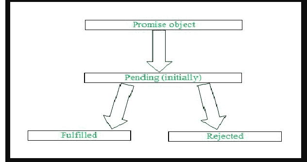

# JavaScript 承诺链

> 原文:[https://www.geeksforgeeks.org/javascript-promise-chaining/](https://www.geeksforgeeks.org/javascript-promise-chaining/)

在本文中，我们将讨论如何在 JavaScript 中执行承诺链。A [Promise](https://www.geeksforgeeks.org/javascript-promises/) 基本上是一个对象，表示异步操作的完成(或失败)及其结果。

承诺有三种状态，基于这些状态，承诺执行结果。

*   **待定:**该状态表示初始状态或完成状态或拒绝状态。
*   **已完成:**该状态表示异步操作成功完成。
*   **拒绝:**该状态表示异步操作被拒绝。



使用 [**执行承诺。然后()**](https://www.geeksforgeeks.org/why-we-use-then-method-in-javascript/) 法写成后宣告承诺。如果我们需要处理发生的任何错误，那么我们使用 [**。赶()**](https://www.geeksforgeeks.org/jquery-deferred-catch-method/) 法写在答应之后。我们也使用 [**。finally()**](https://www.geeksforgeeks.org/javascript-promise-finally-method/) 方法如果我们只想打印我们的结果，而不考虑在承诺执行期间发生的任何错误。

**声明承诺:**我们可以使用以下语法声明承诺。

## java 描述语言

```
let promise =  new Promise((resolve , reject)=>{
                resolve('Hello JavaScript !');
});
```

正如您在上面的语法中看到的，有一个回调函数在 promise 对象中传递，该对象使用两个方法作为参数。首先，一个是 [**resolve()**](https://www.geeksforgeeks.org/javascript-promise-resolve-method/) ，它负责成功完成任何文本或任何可执行的东西在其中传递。

第二个是[**【reject()**](https://www.geeksforgeeks.org/javascript-promise-reject-method/)，它负责一个操作的不成功完成，我们可以传递其中的文本，它会随着我们的错误一起显示出来。

**执行承诺:**我们可以使用以下语法来执行承诺。

*   **方法 1:**

    ## java 描述语言

    ```
    <script>
    let promise = new Promise((resolve, reject) => {
      resolve("Hello JavaScript !");
    });

    promise.then((result) => console.log(result));
    </script>
    ```

    **输出:**如上所示，结果变量用于控制来自**解析()**方法的结果。

    ```
    Hello JavaScript !
    ```

*   **方法二:**

    ## java 描述语言

    ```
    <script>let promise = new Promise((resolve, reject) => {
      resolve("Hello JavaScript !");
    });

    promise.then((result) => {
      console.log(result);
    });
    </script>
    ```

    **输出:**在这个方法中，**内部传递了一个回调函数。然后()**法。在回调函数中，结果变量被声明，负责打印出来自 **resolve()** 方法的结果。

    ```
    Hello JavaScript !
    ```

**承诺链:**承诺链是一个简单的概念，通过它我们可以在我们的**中初始化另一个承诺。然后()**方法，因此我们可以执行我们的结果。

使用承诺链接的语法如下。

## java 描述语言

```
<script>
let promise = new Promise((resolve, reject) => {
  resolve("Hello JavaScript");
});
promise
  .then(
    new Promise((resolve, reject) => {
      resolve("Hello GeeksforGeeks");
    }).then((result1) => {
      console.log(result1);
    })
  )
  .then((result2) => {
    console.log(result2);
  });
</script>
```

**输出:**如上图所示，在执行声明的承诺时，我们正在**内部传递另一个承诺。然后()**并相应地执行我们的结果。

```
Hello GeeksforGeeks 
Hello JavaScript
```

**注意:**你也可以在**里面声明几个承诺。然后()**并相应地执行您的结果。