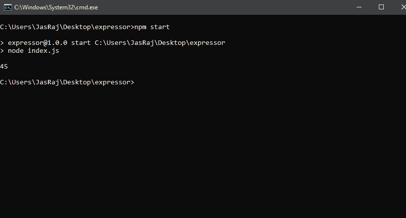
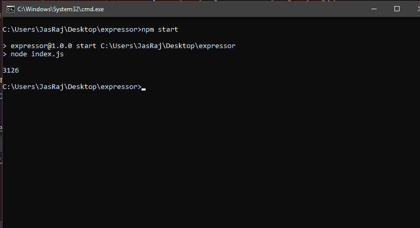

# JavaScript |承诺解析()方法

> 原文:[https://www . geesforgeks . org/JavaScript-promise-resolve-method/](https://www.geeksforgeeks.org/javascript-promise-resolve-method/)

[](https://www.geeksforgeeks.org/javascript-promises/)**是表示用户任务完成或失败的对象。JavaScript 中的承诺可以处于三种状态:待定、履行或拒绝。
在 JavaScript 中使用 Promise 的主要优点是，在 Promise 被拒绝或实现的情况下，用户可以为 Promise 分配回调函数。顾名思义，承诺要么被遵守，要么被打破。所以，一个承诺要么被完成(遵守)，要么被拒绝(违背)。
**Promise resolve()方法:**
JS 中的 Promise.resolve()方法返回一个 Promise 对象，用给定值解析。三种情况中的任何一种都可能发生:**

*   **如果该值是一个承诺，那么承诺将被返回。**
*   **如果该值有一个“然后”附加到承诺，那么返回的承诺将跟随那个“然后”直到最后状态。**
*   **用它的价值履行的诺言将被归还。**

****语法:****

```
Promise.resolve(value);
```

****参数:**
此承诺要解析的值。
**返还价值:**
要么用其价值兑现承诺的承诺被返还。
**示例:****

## **java 描述语言**

```
<script>
    var promise = Promise.resolve(17468);

promise.then(function(val) {
    console.log(val);
});
//Output: 17468
</script>
```

****输出:****

```
17468
```

****解析数组:****

## **java 描述语言**

```
<script>

    const promise = new Promise((resolve, reject) => {
        setTimeout(() => {
            resolve([89, 45, 323]);
        }, 5000);
    });

promise.then(values => {
    console.log(values[1]);
});

</script>
```

****输出:****

```
45 
```

****

****解析另一个承诺:****

## **java 描述语言**

```
<script>

    const promise = Promise.resolve(3126);

const promise1 = new Promise((resolve, reject) => {
    setTimeout(() => {
        promise.then(val => console.log(val));
    }, 5000);
});

promise1.then(vals => {
    console.log(vals);
});

</script>
```

****输出:****

```
3126 
```

****

****支持的浏览器:****

*   **谷歌 Chrome 6.0 及以上版本**
*   **Internet Explorer 9.0 及以上版本**
*   **Mozilla 4.0 及以上版本**
*   **Opera 11.1 及以上**
*   **Safari 5.0 及以上版本**

**JavaScript 最出名的是网页开发，但它也用于各种非浏览器环境。您可以通过以下 [JavaScript 教程](https://www.geeksforgeeks.org/javascript-tutorial/)和 [JavaScript 示例](https://www.geeksforgeeks.org/javascript-examples/)从头开始学习 JavaScript。**