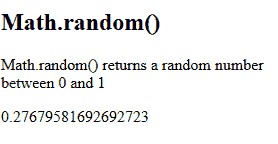
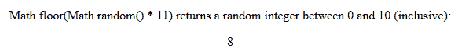
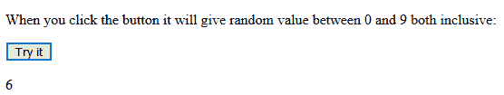
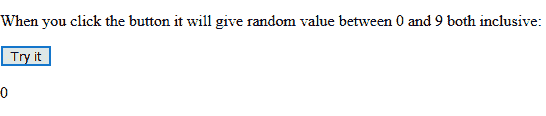

# JavaScript |随机

> 原文:[https://www.geeksforgeeks.org/javascript-random/](https://www.geeksforgeeks.org/javascript-random/)

**Math.random()** 函数用于返回一个介于[0，1]，0(包含)和 1(不包含)之间的浮点伪随机数。这个随机数可以根据所需的范围进行缩放。

**语法:**

```
Math.random()
```

**示例:**本示例使用 Math.random()函数返回一个随机数。

```
<!DOCTYPE html>
<html>

<body>
    <h2>Math.random()</h2>

    <p>
        Math.random() returns a random
        number between 0 and 1
    </p>

    <p id="GFG"></p>

    <!-- Script to use Math.random() function -->
    <script>
        document.getElementById("GFG").innerHTML
                = Math.random();
    </script>
</body>

</html>                    
```

**输出:**


**随机整数:****math . Random()**方法与 **Math.floor()** 函数一起使用，返回随机整数。

**示例:**

```
<!DOCTYPE html>
<html>

<body>
    <center>
        <p>
            Math.floor(Math.random() * 11) returns
            a random integer between 0 and 10 
            (inclusive):
        </p>

        <p id="demo"></p>
    </center>

    <!-- Script to use Math.random() function
    and Math.floor() function to return random
    integer -->
    <script>
        document.getElementById("demo").innerHTML =
                    Math.floor(Math.random() * 11);
    </script>
</body>

</html>                    
```

**输出:**


**适当的随机函数:** JavaScript 函数总是返回一个介于 min 和 max 之间的随机数，其中 min 是包含的，max 可以是包含的，也可以是排除的。
T3】例:

```
<!DOCTYPE html>
<html>

<body>
    <p>
        When you click the button it will
        give a random value between 0 and
        9 both inclusive:
    </p>

    <button onclick="document.getElementById('GFG').innerHTML = 
                getRndInteger(0, 10)">Try it</button>

    <p id="GFG"></p>

    <!-- Script to return random number between
        0 and 10 -->
    <script>
        function getRndInteger(min, max) {
            return Math.floor(Math.random() * (max - min)) + min;
        }
    </script>
</body>

</html>                    
```

**第一次点击输出:**

**第二次点击输出:**
