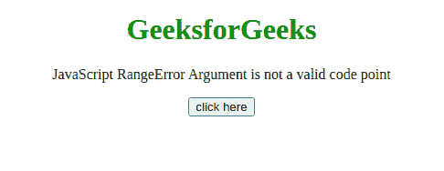
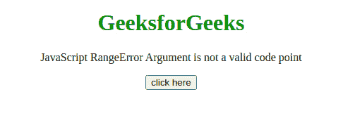

# JavaScript 范围错误参数不是有效的代码点

> 原文:[https://www . geesforgeks . org/JavaScript-range error-argument-不是有效的代码点/](https://www.geeksforgeeks.org/javascript-rangeerror-argument-is-not-a-valid-code-point/)

如果 NaN 值、负整数、非整数或其他大于 0x10FFFF 的值与**字符串. fromCodePoint()** 方法**一起使用，则会出现此 JavaScript 异常**无效代码点**。**

**消息:**

```
RangeError: {0} is not a valid code point (Firefox)
RangeError: Invalid code point {0} (Chromium)

```

**错误类型:**

```
RangeError

```

**错误原因:****字符串。fromCodePoint()** 用于返回使用指定为参数的代码点序列创建的字符串。如果传递的代码点值是 NaN 值、负整数、非整数或大于 0x10FFFF 的值，它将引发此错误。

**示例 1:** 由于传递给方法的值是有效的，因此该示例在不引发任何错误的情况下工作。

## 超文本标记语言

```
<!DOCTYPE html>
<html>
    <head>
        <script src=
"https://code.jquery.com/jquery-3.5.0.js">
        </script>
    </head>
    <body style="text-align: center;">
        <h1 style="color: green;">
            GeeksforGeeks
        </h1>

        <p>
            JavaScript RangeError 
            Argument is not a valid code point
        </p>

        <button onclick="Geeks();">
            click here
        </button>
        <p id="GFG_DOWN"></p>

        <script>
            var el_down = document.getElementById("GFG_DOWN");
            function Geeks() {
                try {
                    String.fromCodePoint(34);
                    el_down.innerHTML = 
                      "'Argument is not a valid code point'" +
                      " error has not occurred";
                } catch (e) {

                    // Show the error in console
                    console.log(e);
                    el_down.innerHTML = 
                      "'Argument is not a valid code point'" +
                      " error has occurred";
                }
            }
        </script>
    </body>
</html>
```

**输出:**



**例 2:** 在本例中，传递给方法的值是 **NaN** 、**T5】，这是一个无效值，因此出现了错误。**

## 超文本标记语言

```
<!DOCTYPE html>
<html>
    <head>
        <script src=
"https://code.jquery.com/jquery-3.5.0.js">
        </script>
    </head>

    <body style="text-align: center;">
        <h1 style="color: green;">
            GeeksforGeeks
        </h1>

        <p>
            JavaScript RangeError 
            Argument is not a valid code point
        </p>

        <button onclick="Geeks();">
            click here
        </button>
        <p id="GFG_DOWN"></p>

        <script>
            var el_down = document.getElementById("GFG_DOWN");
            function Geeks() {
                try {
                    String.fromCodePoint(NaN);
                    el_down.innerHTML = 
                      "'Argument is not a valid code point'" +
                      " error has not occurred";
                } catch (e) {
                    // Show the error in console
                    console.log(e);
                    el_down.innerHTML = 
                      "'Argument is not a valid code point'" +
                      " error has occurred";
                }
            }
        </script>
    </body>
</html>
```

**输出:**

