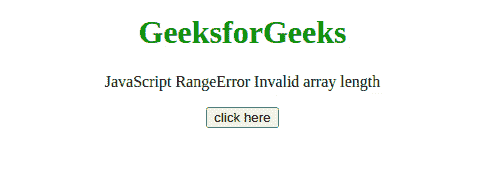
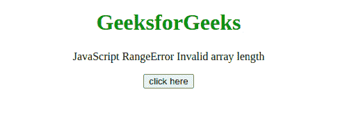

# JavaScript 范围错误–无效数组长度

> 原文:[https://www . geesforgeks . org/JavaScript-range error-invalid-array-length/](https://www.geeksforgeeks.org/javascript-rangeerror-invalid-array-length/)

当创建数组或数组长度为负或大于或等于 2 的数组时，会出现此 JavaScript 异常**无效数组长度**<sup>32。</sup>如果长度属性手动设置为负值或大于等于 2 <sup>32</sup> 的值，也会出现这种情况。

**消息:**

```
RangeError: Array length must be a finite positive integer (Edge)
RangeError: invalid array length (Firefox)
RangeError: Invalid array length (Chrome)
RangeError: Invalid array buffer length (Chrome)

```

**错误类型:**

```
RangeError

```

**错误原因:**数组或 ArrayBuffer 的长度只能用一个无符号的 32 位整数来表示，它只存储 0 到 2 之间的值 <sup>32</sup> -1。创建数组或数组填充器时，如果数组长度为负或大于或等于 2 <sup>32</sup> ，则会出现此错误。

**例 1:** 在本例中，length 属性设置为 6，这是一个有效值，因此没有出现错误。

## 超文本标记语言

```
<!DOCTYPE html>
<html>
    <head>
        <script src=
"https://code.jquery.com/jquery-3.5.0.js">
        </script>
    </head>
    <body style="text-align: center;">
        <h1 style="color: green;">
            GeeksforGeeks
        </h1>

        <p>
            JavaScript RangeError 
            Invalid array length
        </p>

        <button onclick="Geeks();">
            click here
        </button>
        <p id="GFG_DOWN"></p>

        <script>
            var el_down = document.getElementById("GFG_DOWN");
            function Geeks() {
                try {
                    let a = [];
                    a.length = 6;
                    el_down.innerHTML = 
                      "'Invalid array length' "+
                      "error has not occurred";
                } catch (e) {

                    // Show the error in console
                    console.log(e);
                    el_down.innerHTML = 
                      "'Invalid array length' "+
                      "error has occurred";
                }
            }
        </script>
    </body>
</html>
```

**输出:**



**例 2:** 在本例中，length 属性设置为-1，为无效值，因此发生了错误。

## 超文本标记语言

```
<!DOCTYPE html>
<html>
    <head>
        <script src=
"https://code.jquery.com/jquery-3.5.0.js">
        </script>
    </head>
    <body style="text-align: center;">
        <h1 style="color: green;">
            GeeksforGeeks
        </h1>

        <p>
            JavaScript RangeError 
            Invalid array length
        </p>

        <button onclick="Geeks();">
            click here
        </button>
        <p id="GFG_DOWN"></p>

        <script>
            var el_down = document.getElementById("GFG_DOWN");
            function Geeks() {
                try {
                    let a = [];
                    a.length = -1;
                    el_down.innerHTML = 
                      "'Invalid array length' "+
                      "error has not occurred";
                } catch (e) {

                    // Show the error in console
                    console.log(e);
                    el_down.innerHTML = 
                      "'Invalid array length' "+
                      "error has occurred";
                }
            }
        </script>
    </body>
</html>
```

**输出:**

