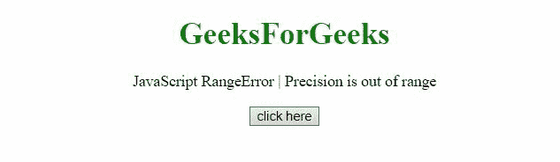

# JavaScript 范围错误|精度超出范围

> 原文:[https://www . geesforgeks . org/JavaScript-range error-precision-超出范围/](https://www.geeksforgeeks.org/javascript-rangeerror-precision-is-out-of-range/)

如果将 0 到 20(或 21)范围之外的数字传递给 toFixed()、toPrecision()或 toExponential()方法，则会出现此 JavaScript 异常**精度超出范围**。

**错误信息:**

> 范围错误:小数位数超出范围(边缘)
> 范围错误:精度超出范围(边缘)
> 范围错误:精度{0}超出范围(火狐)
> 范围错误:toExponential()参数必须介于 0 和 20 之间(Chrome)
> 范围错误:toFixed()位数参数必须介于 0 和 20 之间(Chrome)
> 范围错误:toPrecision()参数必须介于 1 和 21 之间(Chrome)

**错误类型:**

```
RangeError
```

**发生了什么？**

toExponential()、toFixed()和 toPrecision()方法中有一个超出范围的精度参数。

**示例 1:** 在此示例中，当-100 到 toFixed()被传递时，会出现范围错误。

## 超文本标记语言

```
<!DOCTYPE HTML>
<html>

<head>
    <script src=
"https://code.jquery.com/jquery-3.5.0.js">
    </script>
</head>

<body style="text-align:center;">
    <h1 style="color:green;">
        GeeksForGeeks
    </h1>

    <p>
        JavaScript RangeError | Precision is out of range
    </p>

    <button onclick="Geeks();">
        click here
    </button>

    <p id="GFG_DOWN"></p>

    <script>
        var el_down = document.getElementById("GFG_DOWN");
        function Geeks() {
            try {
                3.54.toFixed(-100);
                el_down.innerHTML = "'Precision out of range'"
                        + " error has not occurred";
            } catch (e) {
                el_down.innerHTML = "'Precision out of range'"
                        + " error has occurred";
            }
        } 
    </script>
</body>

</html>
```

**输出:**



**示例 2:** 在本例中，传递给 toExponential()的参数为-4，因此发生了 RangeError。

## 超文本标记语言

```
<!DOCTYPE HTML>
<html>

<head>
    <script src=
"https://code.jquery.com/jquery-3.5.0.js">
    </script>
</head>

<body style="text-align:center;">
    <h1 style="color:green;">
        GeeksForGeeks
    </h1>

    <p>
        JavaScript RangeError | 
        Precision is out of range
    </p>

    <button onclick="Geeks();">
        click here
    </button>
    <p id="GFG_DOWN">
    </p>

    <script>
        var el_down = document.getElementById("GFG_DOWN");
        function Geeks() {
            try {
                77.1234.toExponential(-4);
                el_down.innerHTML = "'Precision out of range'"
                        + " error has not occurred";
            } catch (e) {
                el_down.innerHTML = "'Precision out of range'"
                        + " error has occurred";
            }
        } 
    </script>
</body>

</html>
```

**输出:**


**示例 3:** 在此示例中，范围错误发生的原因是-1 到 toPrecision()被传递。

## 超文本标记语言

```
<!DOCTYPE HTML>
<html>

<head>
    <script src=
"https://code.jquery.com/jquery-3.5.0.js">
    </script>
</head>

<body style="text-align:center;">
    <h1 style="color:green;">
        GeeksForGeeks
    </h1>

    <p>
        JavaScript RangeError | 
        Precision is out of range
    </p>

    <button onclick="Geeks();">
        click here
    </button>
    <p id="GFG_DOWN">
    </p>

    <script>
        var el_down = document.getElementById("GFG_DOWN");
        function Geeks() {
            try {
                5643.9.toPrecision(-1);
                el_down.innerHTML = "'Precision out of range'"
                        + " error has not occurred";
            } catch (e) {
                el_down.innerHTML = "'Precision out of range'"
                        + " error has occurred";
            }
        } 
    </script>
</body>

</html>
```

**输出:**

