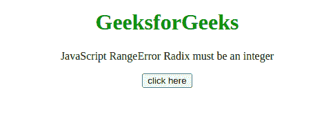
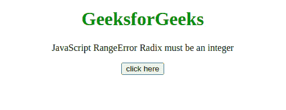

# JavaScript 范围错误–基数必须是整数

> 原文:[https://www . geesforgeks . org/JavaScript-range error-基数必须是整数/](https://www.geeksforgeeks.org/javascript-rangeerror-radix-must-be-an-integer/)

如果传递了**number . prototype . tostring()**或**bigint . prototype . tostring()**方法的基数参数，并且该参数不在 2 到 36 之间，则会出现此 JavaScript 异常**基数必须至少为 2 且不大于 36 的整数**。

**消息:**

```
RangeError: invalid argument (Edge)
RangeError: radix must be an integer at least 2
            and no greater than 36 (Firefox)
RangeError: toString() radix argument must be 
            between 2 and 36 (Chrome)

```

**错误类型:**

```
RangeError
```

**错误原因:**当 Number.prototype.toString()或 BigInt.prototype.toString()方法的可选基数参数被指定且不在 2 到 36 之间时，大于 10 的基数开始使用字母表字符作为不能大于 36 的数字(因为字母表只有 26 个字母)。

**例 1:** 在本例中，传递的参数是 2，所以没有出现错误。

## 超文本标记语言

```
<!DOCTYPE html>
<html>
    <body style="text-align: center;">
        <h1 style="color: green;">
            GeeksforGeeks
        </h1>

        <p>
            JavaScript RangeError 
            Radix must be an integer
        </p>

        <button onclick="Geeks();">
            click here
        </button>
        <p id="GFG_DOWN"></p>

        <script>
            var el_down = document.getElementById("GFG_DOWN");
            function Geeks() {
                try {
                    (42).toString(2);
                    el_down.innerHTML = 
                      "'Radix must be an" + 
                      " integer' error has not occurred";
                } catch (e) {
                    el_down.innerHTML = 
                      "'Radix must be an" + 
                      " integer' error has occurred";
                }
            }
        </script>
    </body>
</html>
```

**输出:**



**例 2:** 在本例中，传递的参数为 0，所以出现了错误。

## 超文本标记语言

```
<!DOCTYPE html>
<html>
    <body style="text-align: center;">
        <h1 style="color: green;">
            GeeksforGeeks
        </h1>

        <p>
            JavaScript RangeError 
            Radix must be an integer
        </p>

        <button onclick="Geeks();">
            click here
        </button>

        <p id="GFG_DOWN"></p>

        <script>
            var el_down = document.getElementById("GFG_DOWN");
            function Geeks() {
                try {
                    (42).toString(0);
                    el_down.innerHTML = 
                      "'Radix must be an" + 
                      " integer' error has not occurred";
                } catch (e) {
                    el_down.innerHTML = 
                      "'Radix must be an" +
                      " integer' error has occurred";
                }
            }
        </script>
    </body>
</html>
```

**输出:**

