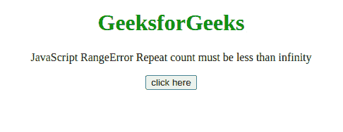
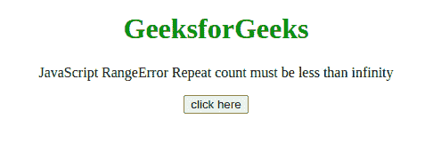

# JavaScript 范围错误–重复计数必须小于无穷大

> 原文:[https://www . geesforgeks . org/JavaScript-range error-repeat-count-必须小于无穷大/](https://www.geeksforgeeks.org/javascript-rangeerror-repeat-count-must-be-less-than-infinity/)

如果**string . prototype . repeat()**方法的传递参数为无穷大，则此 JavaScript 异常**重复计数必须小于无穷大**。

**消息:**

```
RangeError: argument out of range (Edge)
```

RangeError: repeat count must be less than infinity and not overflow maximum string size (Firefox) RangeError: Invalid count value (Chrome)

**错误类型:**

```
RangeError
```

**错误原因:**传递的 String.prototype.repeat()方法的计数参数小于 0 或大于无穷大。

**例 1:** 在本例中，传递的参数是 4，所以没有出现错误。

## 超文本标记语言

```
<!DOCTYPE html>
<html>
    <body style="text-align: center;">
        <h1 style="color: green;">
            GeeksforGeeks
        </h1>

        <p>
            JavaScript RangeError
            Repeat count must be less than infinity
        </p>

        <button onclick="Geeks();">
            click here
        </button>

        <p id="GFG_DOWN"></p>

        <script>
            var el_down = document.getElementById("GFG_DOWN");

            function Geeks() {
                try {
                    "GFG".repeat(4);
                    el_down.innerHTML = "'Repeat count " +
                      "must be less than infinity' " +
                      "error has not occurred";
                } catch (e) {
                    el_down.innerHTML = "'Repeat count " +
                      "must be less than infinity' " + 
                      "error has occurred";
                }
            }
        </script>
    </body>
</html>
```

**输出:**



**例 2:** 在本例中，传递的参数是 2 <sup>32</sup> ，所以出现了错误，

## 超文本标记语言

```
<!DOCTYPE html>
<html>
    <body style="text-align: center;">
        <h1 style="color: green;">
            GeeksforGeeks
        </h1>

        <p>
            JavaScript RangeError 
            Repeat count must be less than infinity
        </p>

        <button onclick="Geeks();">
            click here
        </button>

        <p id="GFG_DOWN"></p>

        <script>
            var el_down = document.getElementById("GFG_DOWN");
            function Geeks() {
                try {
                    "GFG".repeat(2 ** 32);
                    el_down.innerHTML = "'Repeat count " +
                      "must be less than infinity' " + 
                      "error has not occurred";
                } catch (e) {
                    el_down.innerHTML = "'Repeat count " +
                      "must be less than infinity' " + 
                      "error has occurred";
                }
            }
        </script>
    </body>
</html>
```

**输出:**

