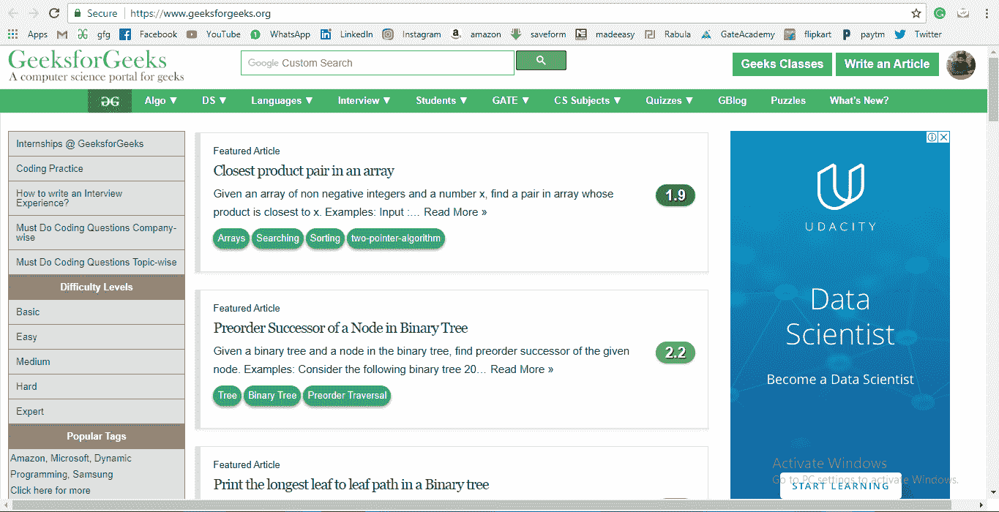
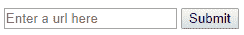

# JavaScript |重定向网址

> 原文:[https://www.geeksforgeeks.org/javascript-redirect-a-url/](https://www.geeksforgeeks.org/javascript-redirect-a-url/)

**先决条件:**

*   [学习基本 HTML](https://www.geeksforgeeks.org/html-basics/)*   [Learn Basic Javascript](https://www.geeksforgeeks.org/understanding-basic-javascript-codes/)

    在 JavaScript 中重定向一个网址只不过是将用户从一个网址发送到另一个网址。在 Javascript 中，window.location 函数用于重定向到一个 URL。

    <center>**JavaScript codes for redirecting to a URL:**</center>

    **Code #1:**

    ```html
    <!DOCTYPE html>
    <html>
    <head>
        <title>Redirect url in Javascript</title>
    </head>
    <body>
    <script>
        var url= "https://www.geeksforgeeks.org";
        window.location = url;
    </script>
    </body>
    </html>
    ```

    **输出:**
    

    **代码#2:**
    下面的代码从用户那里获取一个输入 url，该 url 通过 getElementById()和 window.location 将页面带到该 url。

    ```html
    <!DOCTYPE html>
    <html>
    <head>
        <title>Redirect url in Javascript</title>
    </head>
    <body>
    <input id = "url" type = "text" name = "url" 
                            placeholder = "Enter a url here">
    <input type = "submit" name = "button" onclick = "fun()">
    <script>
    function fun() {
        var url= document.getElementById("url").value;
        document.write("Redirecting to the url in 3 seconds...");
        setTimeout(function(){window.location = url;}, 3000);
    }
    </script>
    </body>
    </html>
    ```

    **输出:**
    
    起初这将是输出，然后如果像(https://www.geeksforgeeks.org/)这样的链接被放在盒子里面，它将重定向到 GeeksforGeeks 的主页，并将如下所示。
    

    执行上述代码的步骤:

    *   用保存这些文件。html 扩展名为 file_name.html
    *   然后在浏览器中打开文件，它会被重定向到 GeeksforGeeks 主页。