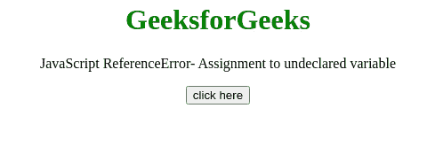
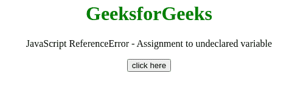

# JavaScript 引用错误–未声明变量的赋值

> 原文:[https://www . geesforgeks . org/JavaScript-reference error-赋值给未声明的变量/](https://www.geeksforgeeks.org/javascript-referenceerror-assignment-to-undeclared-variable/)

如果值已经被赋值给一个未声明的变量，这个 JavaScript 异常**赋值给** **未声明的变量**发生在严格模式下。

**消息:**

```
ReferenceError: assignment to undeclared variable "x" (Firefox)
ReferenceError: "x" is not defined (Chrome)
ReferenceError: Variable undefined in strict mode (Edge)

```

**错误类型:**

```
ReferenceError

```

**错误原因:**在代码的某个地方，有一个没有 var、let 或 const 关键字的赋值。当一个值被赋给一个未声明的变量时，就会出现这个错误。

**示例 1:** 在本例中， **const** 关键字与变量赋值一起使用，因此没有出现错误。

## 超文本标记语言

```
<!DOCTYPE HTML>
<html>  
<head>     
</head>   
<body style="text-align:center;"> 
    <h1 style="color:green;">  
        GeeksforGeeks  
    </h1> 

    <p>
        JavaScript ReferenceError-
        Assignment to undeclared variable 
    </p>

    <button onclick = "Geeks();">
        click here
    </button>
    <p id="GFG_DOWN"> 
    </p>

    <script> 
        var el_down = document.getElementById("GFG_DOWN");
        function GFG() { 
          'use strict'; 
           const var_1 = "Value assigned without declaration"; 
        }
        function Geeks() { 
            try {
                GFG();
                el_down.innerHTML = 
                "'Assignment to undeclared variable'"+
                "error has not occurred";
            } catch(e) {
                el_down.innerHTML = 
                "'Assignment to undeclared variable'"+
                "error has occurred";
            }
        } 
    </script> 
</body>   
</html>
```

**输出:**



**示例 2:** 在本示例中，var、let 或 const 关键字没有与变量赋值一起使用，因此出现了错误。

## 超文本标记语言

```
<!DOCTYPE HTML>
<html>  
<head>     
</head>   
<body style="text-align:center;"> 
    <h1 style="color:green;">  
        GeeksforGeeks  
    </h1> 

    <p>
        JavaScript ReferenceError -
        Assignment to undeclared variable 
    </p>

    <button onclick = "Geeks();">
        click here
    </button>
    <p id="GFG_DOWN"> 
    </p>

    <script> 
        var el_down = document.getElementById("GFG_DOWN");
        function GFG() { 
          'use strict'; 
          var_1 = true; 
        }
        function Geeks() { 
            try {
                GFG();
                el_down.innerHTML = 
                "'Assignment to undeclared variable'"+
                "error has not occurred";
            } catch(e) {
                el_down.innerHTML = 
                "'Assignment to undeclared variable'"+
                "error has occurred";
            }
        } 
    </script> 
</body>   
</html>
```

**输出:**

