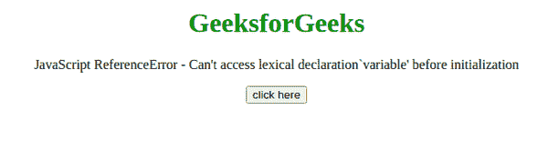
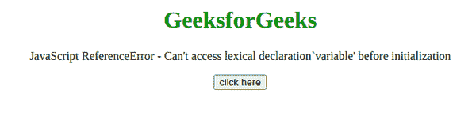

# JavaScript ReferenceError–初始化前无法访问词法声明‘variable’

> 原文:[https://www . geesforgeks . org/JavaScript-reference error-cant-access-词法-声明-变量-初始化前/](https://www.geeksforgeeks.org/javascript-referenceerror-cant-access-lexical-declarationvariable-before-initialization/)

这个 JavaScript 异常**在初始化之前不能访问**词法声明“变量”**如果在初始化之前已经访问了词法变量，就会出现这个异常。当 let 或 const 声明未定义时被访问时，这可能发生在任何 block 语句中。**

**消息:**

```
ReferenceError: Use before declaration (Edge)
ReferenceError: can't access lexical declaration `variable' before 
                initialization (Firefox)
ReferenceError: 'variable' is not defined (Chrome)
```

**错误类型:**

```
ReferenceError
```

**错误原因:**在代码的某个地方，有一个在初始化之前被访问的词法变量。

**示例 1:** 在本例中，const 关键字与 if 语句中的变量一起使用，因此出现了错误。

## 超文本标记语言

```
<!DOCTYPE html>
<html>
    <head>
    </head>
    <body style="text-align: center;">
        <h1 style="color: green;">
            GeeksforGeeks
        </h1>

<p>
          JavaScript ReferenceError -
          Can't access lexical declaration`variable'
          before initialization
        </p>

        <button onclick="Geeks();">
            click here
        </button>
        <p id="GFG_DOWN"></p>

        <script>
            var el_down = document.getElementById("GFG_DOWN");
            function GFG() {
                const var_1 = "This is";
                if (true) {
                    const var_1 = var_1 + "GeeksforGeeks";
                }
            }
            function Geeks() {
                try {
                    GFG();
                    el_down.innerHTML =
                      "'Can't access lexical declaration"+
                      "`variable'before initialization' "+
                      "error has not occurred";
                } catch (e) {
                    el_down.innerHTML =
                      "'Can't access lexical declaration"+
                      "`variable' before initialization'"+
                      " error has occurred";
                }
            }
        </script>
    </body>
</html>
```

**输出:**



**示例 2:** 在本例中，关键字与变量一起使用，因此出现了错误。

## 超文本标记语言

```
<!DOCTYPE html>
<html>
    <head>
    </head>
    <body style="text-align: center;">
        <h1 style="color: green;">
            GeeksforGeeks
        </h1>

<p>
          JavaScript ReferenceError -
          Can't access lexical declaration`variable'
          before initialization
        </p>

        <button onclick="Geeks();">
            click here
        </button>
        <p id="GFG_DOWN"></p>

        <script>
            var el_down = document.getElementById("GFG_DOWN");
            function GFG() {
                let var_1 = 3;
                if (true) {
                     var_1 = var_1 + 5;
                }
            }
            function Geeks() {
                try {
                    GFG();
                    el_down.innerHTML =
                      "'Can't access lexical declaration"+
                      "`variable' before initialization'"+
                      " error has not occurred";
                } catch (e) {
                    el_down.innerHTML =
                      "'Can't access lexical declaration"+
                      "`variable'before initialization'"+
                      " error has occurred";
                }
            }
        </script>
    </body>
</html>
```

**输出:**

