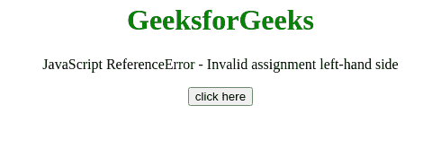

# JavaScript 引用错误–无效赋值左侧

> 原文:[https://www . geesforgeks . org/JavaScript-reference error-无效-赋值-左侧/](https://www.geeksforgeeks.org/javascript-referenceerror-invalid-assignment-left-hand-side/)

**参考的基本示例错误-无效分配左侧，**运行代码并检查控制台

**示例:**

## java 描述语言

```
<script>
    if (Math.PI = 10 || Math.PI = 5) { 
        document.write("Inside Loop");
    }
</script>
```

**输出:**

```
ReferenceError: Invalid left-hand side in assignment
```

如果代码中的某个地方有错误的赋值，就会出现这个 JavaScript 异常**左侧的无效赋值**。单个“=”符号而不是“==”或“===”是无效赋值。

**消息:**

```
ReferenceError: invalid assignment left-hand side

```

**错误类型:**

```
ReferenceError

```

**错误原因:**可能是**赋值**操作符和**比较**操作符之间有误解。

**例 1:** 在本例中，“=”运算符被误用为“==”，因此出现了错误。

## 超文本标记语言

```
<!DOCTYPE html>
<html>
    <head> </head>
    <body style="text-align: center;">
        <h1 style="color: green;">
            GeeksforGeeks
        </h1>
        <p>
            JavaScript ReferenceError - 
            Invalid assignment left-hand side
        </p>

        <button onclick="Geeks();">
            click here
        </button>
        <p id="GFG_DOWN"></p>

        <script>
            var el_down = document.getElementById("GFG_DOWN");
            function Geeks() {
                try {
                    if ((Math.PI = 10 || Math.PI = 5)) {
                        document.write("Inside Loop");
                    }
                    el_down.innerHTML = 
                      "'Invalid assignment left-hand side'" + 
                      " error has not occurred";
                } catch (e) {
                    el_down.innerHTML = 
                      "'Invalid assignment left-hand side'" + 
                      "error has occurred";
                }
            }
        </script>
    </body>
</html>
```

**输出:**


**例 2:** 在本例中， **+运算符**用于声明，因此没有出现错误。

## 超文本标记语言

```
<!DOCTYPE HTML>
<html>  
<head>     
</head>   
<body style="text-align:center;"> 
    <h1 style="color:green;">  
        GeeksforGeeks  
    </h1> 
    <p>
        JavaScript ReferenceError -
        Invalid assignment left-hand side
    </p>

    <button onclick = "Geeks();">
        click here
    </button>
    <p id="GFG_DOWN"> 
    </p>

    <script> 
        var el_down = document.getElementById("GFG_DOWN");
        function Geeks() { 
            try {
                var str = 'Hello, '
                + 'Geeks'; // Error Here
                el_down.innerHTML = 
                "'Invalid assignment left-hand side'"+
                "error has not occurred";
            } catch(e) {
                el_down.innerHTML = 
                "'Invalid assignment left-hand side'"+
                "error has occurred";
            }
        } 
    </script> 
</body>   
</html>
```

**输出:**

