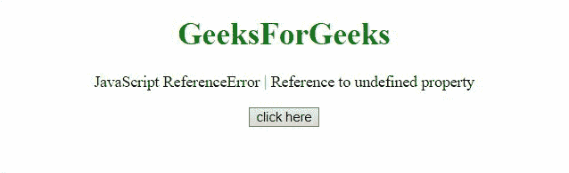

# JavaScript 引用错误–引用未定义的属性“x”

> 原文:[https://www . geesforgeks . org/JavaScript-reference error-reference-to-undefined-property-x/](https://www.geeksforgeeks.org/javascript-referenceerror-reference-to-undefined-property-x/)

如果脚本试图访问不存在的对象属性，就会出现引用未定义属性的 JavaScript 警告**。**

**消息:**

```
ReferenceError: reference to undefined property "x" (Firefox)

```

**错误类型:**

```
ReferenceError(Only reported by firefox browser)

```

**错误原因:**脚本试图访问不存在的对象属性。

**例 1:** 在本例中，访问了有效属性，因此没有出现错误。

## 超文本标记语言

```
<!DOCTYPE html>
<html>
    <head>
        <script src=
"https://code.jquery.com/jquery-3.5.0.js">
        </script>
    </head>
    <body style="text-align: center;">
        <h1 style="color: green;">
            GeeksforGeeks
        </h1>

<p>
            JavaScript ReferenceError 
            Reference to undefined property
        </p>

        <button onclick="Geeks();">
            click here
        </button>
        <p id="GFG_DOWN"></p>

        <script>
            var el_down = document.getElementById("GFG_DOWN");
            function GFG() {
                "use strict";
                var AR_GFG = { prop_1: "Val_1" };
                return AR_GFG.prop_1;
            }
            function Geeks() {
                try {
                    GFG();
                    el_down.innerHTML =
                      "'Reference to undefined property'"+
                      " error has not occurred";
                } catch (e) {
                    el_down.innerHTML = 
                      "'Reference to undefined property'"+
                      "error has occurred";
                }
            }
        </script>
    </body>
</html>
```

**输出:**


**例 2:** 在本例中，访问了未定义的属性，因此出现了错误。

## 超文本标记语言

```
<!DOCTYPE html>
<html>
    <head>
        <script src=
"https://code.jquery.com/jquery-3.5.0.js">
        </script>
    </head>
    <body style="text-align: center;">
        <h1 style="color: green;">
            GeeksforGeeks
        </h1>

<p>
            JavaScript ReferenceError 
            Reference to undefined property
        </p>

        <button onclick="Geeks();">
            click here
        </button>
        <p id="GFG_DOWN"></p>

        <script>
            var el_down = document.getElementById("GFG_DOWN");
            function GFG() {
                "use strict";
                var GFG = {};
                return GFG.prop1;
            }
            function Geeks() {
                try {
                    GFG();
                    el_down.innerHTML = 
                      "'Reference to undefined property'"+
                      "error has not occurred";
                } catch (e) {
                    el_down.innerHTML = 
                      "'Reference to undefined property'"+
                      "error has occurred";
                }
            }
        </script>
    </body>
</html>
```

**输出:**

