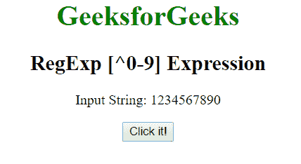
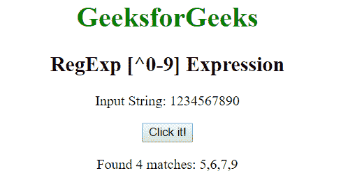
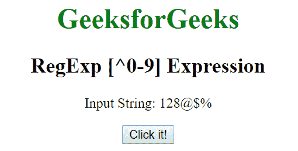

# JavaScript | RegExp [^0-9]表达式

> 原文:[https://www . geesforgeks . org/JavaScript-regexp-0-9-expression-2/](https://www.geeksforgeeks.org/javascript-regexp-0-9-expression-2/)

JavaScript 中的 **RegExp [^0-9]表达式**用于搜索不在括号内的任何数字。括号内的字符可以是一个数字或一串数字。

**语法:**

```
/[^0-9]/ 
```

或者

```
new RegExp("[^0-9]")
```

**带修饰符的语法:**

```
/[^0-9]/g 
```

或者

```
new RegExp("[^0-9]", "g")
```

**示例 1:** 本示例搜索整个字符串中不在[0-4]之间的数字。

```
<!DOCTYPE html>
<html>

<head>
    <title>
        JavaScript RegExp [^0-9] Expression
    </title>
</head>

<body style="text-align:center">

    <h1 style="color:green">
        GeeksforGeeks
    </h1>

    <h2>RegExp [^0-9] Expression</h2>

    <p>Input String: 1234567890</p>

    <button onclick="geek()">
        Click it!
    </button>

    <p id="app"></p>

    <script>
        function geek() {
            var str1 = "123456790";
            var regex4 = /[^0-4]/g;
            var match4 = str1.match(regex4);

            document.getElementById("app").innerHTML = 
                    "Found " + match4.length
                    + " matches: " + match4;
        }
    </script>
</body>

</html>                    
```

**输出:**
**点击按钮前:**

**点击按钮后:**


**示例 2:** 本示例搜索整个字符串中不在[0-9]之间的数字，并用哈希(#)替换字符。

```
<!DOCTYPE html>
<html>

<head>
    <title>
        JavaScript RegExp [^0-9] Expression
    </title>
</head>

<body style="text-align:center">

    <h1 style="color:green">
        GeeksforGeeks
    </h1>

    <h2>RegExp [^0-9] Expression</h2>

    <p>Input String: 128@$%</p>

    <button onclick="geek()">
        Click it!
    </button>

    <p id="app"></p>

    <script>
        function geek() {
           var str1 = "128@$%";            
           var replacement = "#";
            var regex4 = new RegExp("[^0-9]", "g");
            var match4 = str1.replace(regex4, replacement);

            document.getElementById("app").innerHTML =
                    "Found " + match4.length 
                    + " matches: " +  match4;
        }
    </script>
</body>

</html>
```

**输出:**
**点击按钮前:**

**点击按钮后:**


**支持的浏览器:**下面列出了**regexp【^0-9】表达式**支持的浏览器:

*   谷歌 Chrome
*   苹果 Safari
*   Mozilla Firefox
*   歌剧
*   微软公司出品的 web 浏览器