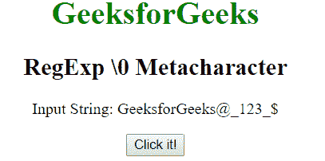
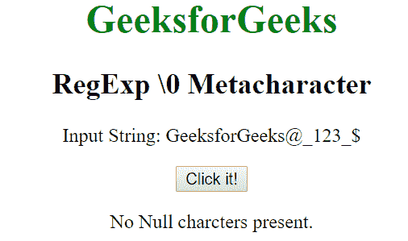
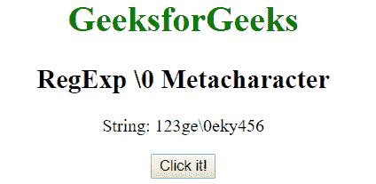

# JavaScript | RegExp \0 元字符

> 原文:[https://www . geesforgeks . org/JavaScript-regexp-0-元字符/](https://www.geeksforgeeks.org/javascript-regexp-0-metacharacter/)

JavaScript 中的**正则表达式\0 元字符**用于查找空字符。如果找到，它返回位置，否则返回-1。

**语法:**

```
/\0/ 
```

或者

```
new RegExp("\\0")
```

**示例 1:** 本示例在字符串中搜索空字符。

```
<!DOCTYPE html>
<html>

<head>
    <title>
        JavaScript RegExp \0 Metacharacter
    </title>
</head>

<body style="text-align:center">

    <h1 style="color:green">
        GeeksforGeeks
    </h1>

    <h2>RegExp \0 Metacharacter</h2>

    <p>Input String: GeeksforGeeks@_123_{content}lt;/p>

    <button onclick="geek()">
        Click it!
    </button>

    <p id="app"></p>

    <script>
        function geek() {
            var str1 = "GeeksforGeeks@_123_{content}quot;;
            var regex4 = /\0/;
            var match4 = str1.search(regex4);
            if(match4 == -1) {         
                document.getElementById("app").innerHTML
                    = "No Null charcters present. ";
            } 
            else {
                document.getElementById("app").innerHTML
                    = "Index of Null character: " + match4;
            }
        }
    </script>
</body>

</html>                    
```

**输出:**
**点击按钮前:**

**点击按钮后:**


**示例 2:** 本示例搜索空字符在字符串中的位置。

```
<!DOCTYPE html>
<html>

<head>
    <title>
        JavaScript RegExp \0 Metacharacter
    </title>
</head>

<body style="text-align:center">

    <h1 style="color:green">
        GeeksforGeeks
    </h1>

    <h2>RegExp \0 Metacharacter</h2>

    <p>String: 123ge\0eky456</p>

    <button onclick="geek()">
        Click it!
    </button>

    <p id="app"></p>

    <script>
        function geek() {
            var str1 = "123ge\0eky456";
            var regex4 = new RegExp("\\0");         
            var match4 = str1.search(regex4);
            document.getElementById("app").innerHTML = 
                " Index of NULL character: " + match4;
        }
    </script>
</body>

</html>                    
```

**输出:**
**点击按钮前:**

**点击按钮后:**


**支持的浏览器:**下面列出了**正则表达式\0 元字符**支持的浏览器:

*   谷歌 Chrome
*   苹果 Safari
*   Mozilla Firefox
*   歌剧
*   微软公司出品的 web 浏览器