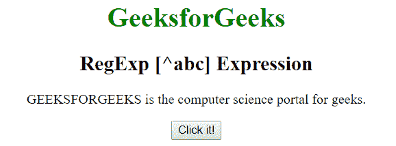
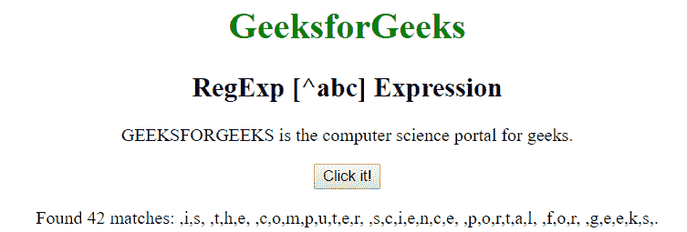
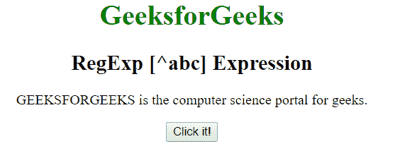
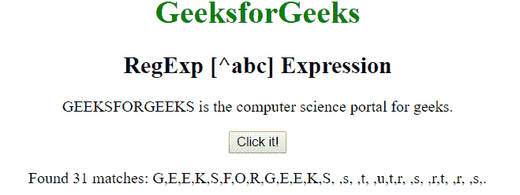

# JavaScript | RegExp [^abc]表达式

> 原文:[https://www . geesforgeks . org/JavaScript-regexp-ABC-expression-2/](https://www.geeksforgeeks.org/javascript-regexp-abc-expression-2/)

JavaScript 中的 **RegExp [^abc]表达式**用于搜索不在括号内的任何字符。括号内的字符可以是单个字符或一系列字符。

*   **【A-Z】:**用于匹配从大写 A 到大写 Z 的任意字符
*   **【a-z】:**用于匹配小写 a 到小写 z 的任意字符。
*   **【A-z】:**用于匹配从大写 A 到小写 z 的任意字符。
*   **【ABC…】:**用于匹配括号之间的任意字符。

**语法:**

```
/[^abc]/ 
```

或者

```
new RegExp("[^abc]")
```

**带修饰符的语法:**

```
/\[^abc]/g 
```

或者

```
new RegExp("[^abc]", "g")
```

**示例 1:** 本示例搜索不在[A-G]之间的字符，即整个字符串中大写的 A 到大写的 G。

```
<!DOCTYPE html>
<html>

<head>
    <title>
        JavaScript RegExp [^abc] Expression
    </title>
</head>

<body style="text-align:center">

    <h1 style="color:green">
        GeeksforGeeks
    </h1>

    <h2>RegExp [^abc] Expression</h2>

    <p>
        GEEKSFORGEEKS is the computer 
        science portal for geeks.
    </p>

    <button onclick="geek()">
        Click it!
    </button>

    <p id="app"></p>

    <script>
        function geek() {
            var str1 = "GEEKSFORGEEKS is the computer "
                        + "science portal for geeks.";

            var regex4 = /[^A-Z]/g;
            var match4 = str1.match(regex4);

            document.getElementById("app").innerHTML = 
                    "Found " + match4.length 
                    + " matches: " + match4;
        }
    </script>
</body>

</html>                    
```

**输出:**

*   **点击按钮前:**
    
*   **点击按钮后:**
    

**示例 2:** 本示例搜索不在[a-g]之间的字符，即整个字符串中的小写 a 到小写 g。

```
<!DOCTYPE html>
<html>

<head>
    <title>
        JavaScript RegExp [^abc] Expression
    </title>
</head>

<body style="text-align:center">

    <h1 style="color:green">
        GeeksforGeeks
    </h1>

    <h2>RegExp [^abc] Expression</h2>

    <p>
        GEEKSFORGEEKS is the computer 
        science portal for geeks.
    </p>

    <button onclick="geek()">
        Click it!
    </button>

    <p id="app"></p>

    <script>
        function geek() {
            var str1 = "GEEKSFORGEEKS is the computer "
                        + "science portal for geeks.";

            var regex4 = /[^a-p]/g;
            var match4 = str1.match(regex4);

            document.getElementById("app").innerHTML = 
                        "Found " + match4.length
                        + " matches: " + match4;
        }
    </script>
</body>

</html>                    
```

**输出:**

*   **点击按钮前:**
    
*   **点击按钮后:**
    

**支持的浏览器:**下面列出了**regexp【^abc】表达式**支持的浏览器:

*   谷歌 Chrome
*   苹果 Safari
*   Mozilla Firefox
*   歌剧
*   微软公司出品的 web 浏览器