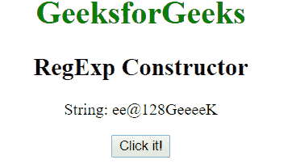
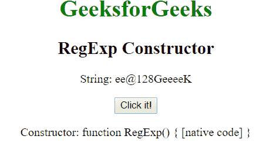
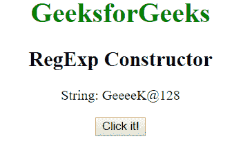

# JavaScript | RegExp 构造函数

> 原文:[https://www . geesforgeks . org/JavaScript-regexp-constructor/](https://www.geeksforgeeks.org/javascript-regexp-constructor/)

JavaScript 中的**正则表达式构造函数**用于*返回创建正则表达式对象原型的函数，即对象的构造函数*。它返回不同 JavaScript 类型的不同引用:

*   **正则表达式:**构造函数属性为正则表达式返回**函数 RegExp(){[本机代码] }** 。
*   **Numbers:** 构造函数属性返回**函数 Number(){[本机代码] }** 为 JavaScript 数字。
*   **Strings:** 构造函数属性返回 JavaScript 字符串的**函数 String(){[本机代码] }** 。

**语法:**

```
RegExpObject.constructor
```

**示例-1:** 本示例返回变量 regex4 的构造函数类型。

## 超文本标记语言

```
<!DOCTYPE html>
<html>

<body style="text-align:center">
    <h1 style="color:green">
      GeeksforGeeks
  </h1>
    <h2>
      RegExp Constructor
  </h2>

<p>
      String: ee@128GeeeeK
  </p>

    <button onclick="geek()">
      Click it!
  </button>
    <p id="app"></p>

    <script>
        function geek() {
            var str1 = "ee@128GeeeeK";
            var regex4 = new RegExp("e{2, }", "gi");
            var rex = regex4.constructor;
            document.getElementById("app").innerHTML =
                " Constructor: " + rex;
        }
    </script>
</body>

</html>
```

**输出:**
**点击按钮前:**



**点击按钮后:**



**示例-2:** 本示例返回变量 match4 上的构造函数类型。

## 超文本标记语言

```
<!DOCTYPE html>
<html>

<body style="text-align:center">
    <h1 style="color:green">
      GeeksforGeeks
  </h1>
    <h2>
      RegExp Constructor
  </h2>

<p>
      String: GeeeeK@128
  </p>

    <button onclick="geek()">
      Click it!
  </button>
    <p id="app"></p>

    <script>
        function geek() {
            var str1 = "GeeeeK@128";
            var regex4 = new RegExp("e{2, }", "gi");
            var replace = "{content}quot;;
            var match4 = str1.replace(regex4, replace);
            var rx = match4.constructor;
            document.getElementById("app").innerHTML =
                " Constructor: " + rx;
        }
    </script>
</body>

</html>
```

**输出:**
**点击按钮前:**



**点击按钮后:**


**支持的浏览器:****正则表达式构造器**支持的浏览器如下:

*   谷歌 Chrome 1 及以上版本
*   边缘 12 及以上
*   Firefox 1 及以上版本
*   Internet Explorer 4 及以上版本
*   歌剧 5 及以上
*   Safari 1 及以上