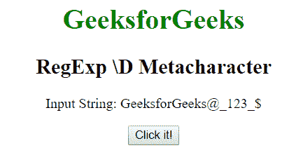
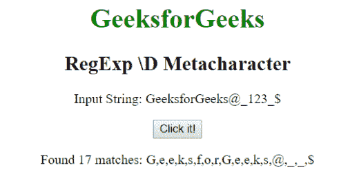
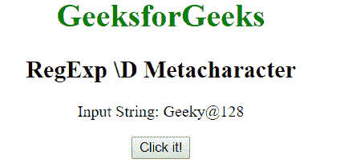
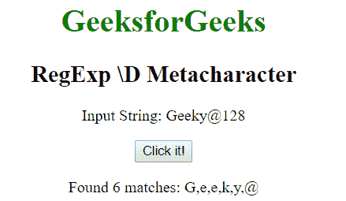

# JavaScript | RegExp \D 元字符

> 原文:[https://www . geesforgeks . org/JavaScript-regexp-d-meta character-2/](https://www.geeksforgeeks.org/javascript-regexp-d-metacharacter-2/)

JavaScript 中的**正则表达式\D 元字符**用于搜索非数字字符，即除数字以外的所有字符。这和^0-9].一样

**语法:**

```
/\D/ 
```

或者

```
new RegExp("\\D")
```

**带修饰符的语法:**

```
/\D/g 
```

或者

```
new RegExp("\\D", "g")
```

**示例 1:** 本示例搜索整个字符串中的非数字字符。

```
<!DOCTYPE html>
<html>

<head>
    <title>
        JavaScript RegExp \D Metacharacter
    </title>
</head>

<body style="text-align:center">

    <h1 style="color:green">
        GeeksforGeeks
    </h1>

    <h2>RegExp \D Metacharacter</h2>

    <p>Input String: GeeksforGeeks@_123_{content}lt;/p>

    <button onclick="geek()">
        Click it!
    </button>

    <p id="app"></p>

    <script>
        function geek() {
            var str1 = "GeeksforGeeks@_123_{content}quot;;
            var regex4 = /\D/g;
            var match4 = str1.match(regex4);

            document.getElementById("app").innerHTML
                    = "Found " + match4.length
                    + " matches: " + match4;
        }
    </script>
</body>

</html>                    
```

**输出:**
**点击按钮前:**

**点击按钮后:**


**示例 2:** 本示例搜索字符串中的非数字字符。

```
<!DOCTYPE html>
<html>

<head>
    <title>
        JavaScript RegExp \D Metacharacter
    </title>
</head>

<body style="text-align:center">

    <h1 style="color:green">
        GeeksforGeeks
    </h1>

    <h2>RegExp \D Metacharacter</h2>

    <p>Input String: Geeky@128</p>

    <button onclick="geek()">
        Click it!
    </button>

    <p id="app"></p>

    <script>
        function geek() {
            var str1 = "Geeky@128";
            var regex4 = new RegExp("\\D", "g");         
            var match4 = str1.match(regex4);

            document.getElementById("app").innerHTML
                    = "Found " + match4.length
                    + " matches: " + match4;
        }
    </script>
</body>

</html>                    
```

**输出:**
**点击按钮前:**

**点击按钮后:**


**支持的浏览器:**下面列出了**正则表达式\D 元字符**支持的浏览器:

*   谷歌 Chrome
*   苹果 Safari
*   Mozilla Firefox
*   歌剧
*   微软公司出品的 web 浏览器