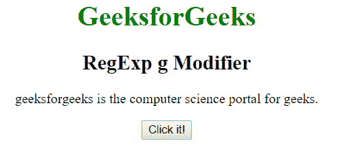
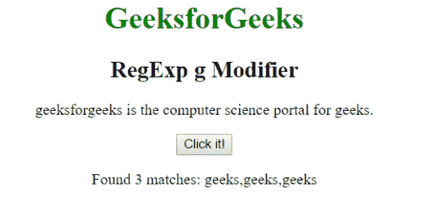
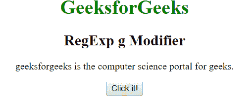
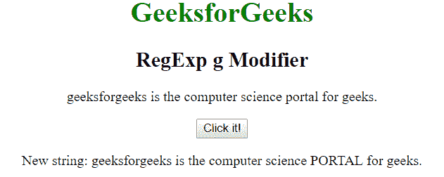

# JavaScript | RegExp g 修饰符

> 哎哎哎:# t0]https://www . geeksforgeeks . org/JavaScript-regexp-g-modifier/

JavaScript 中的 **RegExp g 修饰符**用于查找模式的所有出现，而不是在第一次匹配后停止，即它执行全局匹配。

**语法:**

```
/regexp/g 
```

或者

```
new RegExp("regexp", "g")
```

**示例 1:** 本示例在整个字符串中搜索单词“极客”。

```
<!DOCTYPE html>
<html>

<head>
    <title>
        JavaScript RegExp g Modifier
    </title>
</head>

<body style="text-align:center">

    <h1 style="color:green">
        GeeksforGeeks
    </h1>

    <h2>RegExp g Modifier</h2>

    <p>
        geeksforgeeks is the computer 
        science portal for geeks.
    </p>

    <button onclick="geek()">
        Click it!
    </button>

    <p id="app"></p>

    <script>
        function geek() {
        var str1 = "geeksforgeeks is the computer "
                 + "science portal for geeks.";
        var regex4 = /geeks/g;
        var match4 = str1.match(regex4);

        document.getElementById("app").innerHTML = 
                    "Found " + match4.length
                    + " matches: " + match4;
        }
    </script>
</body>

</html>                    
```

**输出:**
**点击按钮前:**

**点击按钮后:**


**示例 2:** 本示例在整个字符串中搜索单词“portal”，并将其替换为“PORTAL”。

```
<!DOCTYPE html>
<html>

<head>
    <title>
        JavaScript RegExp g Modifier
    </title>
</head>

<body style="text-align:center">

    <h1 style="color:green">
        GeeksforGeeks
    </h1>

    <h2>RegExp g Modifier</h2>

    <p>
        geeksforgeeks is the computer 
        science portal for geeks.
    </p>

    <button onclick="geek()">
        Click it!
    </button>

    <p id="app"></p>

    <script>
        function geek() {
        var str1 = "geeksforgeeks is the computer "
                 + "science portal for geeks.";
        var regex4 = new RegExp("portal", "g");         
        var replace = "PORTAL";
        var match4 = str1.replace(regex4, replace);
            document.getElementById("app").innerHTML = 
            " New string: " + match4;
        }
    </script>
</body>

</html>                    
```

**输出:**
**点击按钮前:**

**点击按钮后:**


**支持的浏览器:**下面列出了**正则表达式修改器**支持的浏览器:

*   谷歌 Chrome
*   苹果 Safari
*   Mozilla Firefox
*   歌剧
*   微软公司出品的 web 浏览器