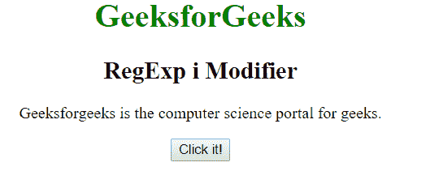
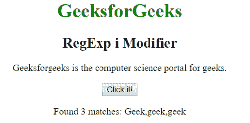
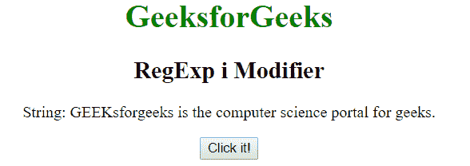
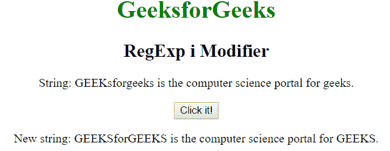

# JavaScript | RegExp i 修改

> 哎哎哎:# t0]https://www . geeksforgeeks . org/JavaScript-regexp-I-modifier/

JavaScript 中的**正则表达式 I 修饰符**用于在字符串中执行不区分大小写的匹配。

**语法:**

```
/regexp/i 
```

或者

```
new RegExp("regexp", "i")
```

**示例 1:** 本示例匹配单词“geeks”或“Geeks”(不区分大小写)并显示。

```
<!DOCTYPE html>
<html>

<head>
    <title>
        JavaScript RegExp i Modifier
    </title>
</head>

<body style="text-align:center">
    <h1 style="color:green">
        GeeksforGeeks
    </h1>

    <h2>RegExp i Modifier</h2>

    <p>
        Geeksforgeeks is the computer 
        science portal for geeks.
    </p>

    <button onclick="geek()">
        Click it!
    </button>

    <p id="app"></p>
    <script>
    function geek() {
        var str1 = "Geeksforgeeks is the computer "
                + "science portal for geeks.";
        var regex4 = /geek/gi;
        var match4 = str1.match(regex4);

        document.getElementById("app").innerHTML = 
                    "Found " + match4.length
                    + " matches: " + match4;
    }
    </script>
</body>

</html>                    
```

**输出:**
**点击按钮前:**

**点击按钮后:**


**示例 2:** 此示例匹配单词“geeks”或“GEEKS”(不区分大小写)，并将其替换为“Geeks”。

```
<!DOCTYPE html>
<html>

<head>
    <title>
        JavaScript RegExp i Modifier
    </title>
</head>

<body style="text-align:center">
    <h1 style="color:green">
        GeeksforGeeks
    </h1>

    <h2>RegExp i Modifier</h2>

    <p>
        String: GEEKsforgeeks is the computer
        science portal for geeks.
    </p>

    <button onclick="geek()">
        Click it!
    </button>

    <p id="app"></p>

    <script>
        function geek() {
            var str1 = "GEEKsforgeeks is the computer "
                    + "science portal for geeks.";     
            var regex4 = new RegExp("geeks", "ig");         
            var replace = "GEEKS";
            var match4 = str1.replace(regex4, replace);
            document.getElementById("app").innerHTML = 
            " New string: " + match4;
        }
    </script>
</body>

</html>                    
```

**输出:**
**点击按钮前:**

**点击按钮后:**


**支持的浏览器:**下面列出了**正则表达式修改器**支持的浏览器:

*   谷歌 Chrome
*   苹果 Safari
*   Mozilla Firefox
*   歌剧
*   微软公司出品的 web 浏览器