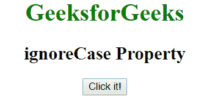
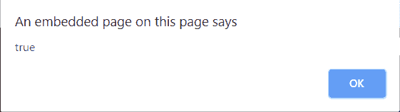
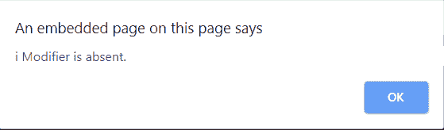

# JavaScript | RegExp ignoreCase 属性

> 原文:[https://www . geesforgeks . org/JavaScript-regexp-ignore case-property/](https://www.geeksforgeeks.org/javascript-regexp-ignorecase-property/)

JavaScript 中的 **RegExp ignoreCase 属性**用于指定是否设置了**“I”**修改器。如果设置了**“I”**修饰符，则该属性返回真，否则返回假。
**语法:**

```
RegexObj.ignoreCase
```

**返回值:**如果设置了 I 修饰符，则返回 true，否则返回 false。
**示例 1:** 本示例检查正则表达式是否包含 I 修饰符。

## 超文本标记语言

```
<!DOCTYPE html>
<html>
    <head>
        <title>
            RegExp ignoreCase Property
        </title>
    </head>

    <body style="text-align:center">

        <h1 style="color:green">
            GeeksforGeeks
        </h1>

        <h2>ignoreCase Property</h2>

        <button onclick="geek()">
            Click it!
        </button>

        <script>
            function geek() {
                var regex = new RegExp('foo', 'i');
                alert(regex.ignoreCase);
            }
        </script>
    </body>
</html>                   
```

**输出:**
**点击按钮前:**



**点击按钮后:**



**示例 2:** 本示例检查正则表达式是否包含修饰符。

## 超文本标记语言

```
<!DOCTYPE html>
<html>

<head>
    <title>
        JavaScript ignoreCase Property
    </title>
</head>

<body style="text-align:center">

    <h1 style="color:green">
        GeeksforGeeks
    </h1>

    <h2>
        ignoreCase Property
    </h2>

    <button onclick="geek()">
        Click it!
    </button>

    <script>
        function geek() {
            var regex = /[a-d]/;
            var str =
                "GeeksforGeeks\n"+
                "is the computer\n"+
                "science portal for geeks.";

            if (regex.ignoreCase) {
                alert("i Modifier is present");
            } else {
                alert("i Modifier is absent.");
            }
        }
    </script>
</body>

</html>                   
```

**输出:**
**点击按钮前:**


**点击按钮后:**



**支持的浏览器:**JavaScript ignore case 属性支持的浏览器如下:

*   谷歌 Chrome 1 及以上版本
*   边缘 12 及以上
*   Firefox 1 及以上版本
*   Internet Explorer 5.5 及以上版本
*   歌剧 5 及以上
*   Safari 1 及以上