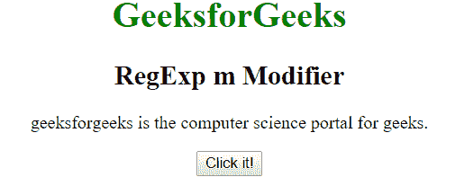
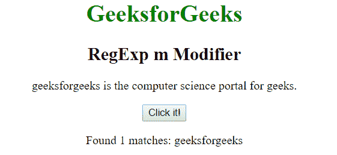
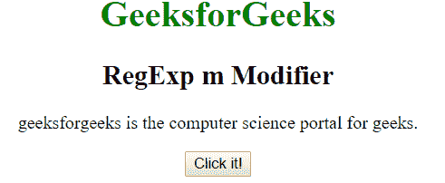
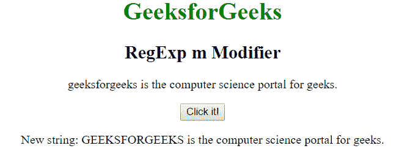

# JavaScript | RegExp m 修饰符

> 哎哎哎:# t0]https://www . geeksforgeeks . org/JavaScript-regexp-m-modifier/

JavaScript 中的 **RegExp m 修饰符**用于执行多行匹配。当接管多行时，它将开始和结束字符(^和$)作为工作字符。它匹配每一行的开头或结尾。它区分大小写。

**语法:**

```
/regexp/m 
```

或者

```
new RegExp("regexp", "m")
```

**示例 1:** 本示例搜索字符串中每行开头的单词“geeksforgeeks”。

```
<!DOCTYPE html>
<html>

<head>
    <title>
        JavaScript RegExp m Modifier
    </title>
</head>

<body style="text-align:center">
    <h1 style="color:green">
        GeeksforGeeks
    </h1>

    <h2>RegExp m Modifier</h2>

    <p>
        geeksforgeeks is the computer science
        portal for geeks.
    </p>

    <button onclick="geek()">
        Click it!
    </button>

    <p id="app"></p>

    <script>
        function geek() {
            var str1 = "geeksforgeeks is the computer "
                       + "science portal for geeks.";
            var regex4 = /^geeksforgeeks/gm;
            var match4 = str1.match(regex4);

            document.getElementById("app").innerHTML = 
                    "Found " + match4.length
                    + " matches: " + match4;
        }
    </script>
</body>

</html>                    
```

**输出:**
**点击按钮前:**

**点击按钮后:**


**示例 2:** 本示例搜索字符串中每行开头的单词“geeksforgeeks”，并将其替换为“GEEKSFORGEEKS”。

```
<!DOCTYPE html>
<html>

<head>
    <title>
        JavaScript RegExp m Modifier
    </title>
</head>

<body style="text-align:center">
    <h1 style="color:green">
        GeeksforGeeks
    </h1>

    <h2>RegExp m Modifier</h2>

    <p>
        geeksforgeeks is the computer science
        portal for geeks.
    </p>

    <button onclick="geek()">
        Click it!
    </button>

    <p id="app"></p>

    <script>
        function geek() {
            var str1 = "geeksforgeeks is the computer "
                       + "science portal for geeks.";
            var regex4 = new RegExp("^geeksforgeeks", "m");         
            var replace = "GEEKSFORGEEKS";
            var match4 = str1.replace(regex4, replace);
            document.getElementById("app").innerHTML = 
            " New string: " + match4;
        }
    </script>
</body>

</html>                    
```

**输出:**
**点击按钮前:**

**点击按钮后:**


**支持的浏览器:**下面列出了 **RegExp m 修改器**支持的浏览器:

*   谷歌 Chrome
*   苹果 Safari
*   Mozilla Firefox
*   歌剧
*   微软公司出品的 web 浏览器