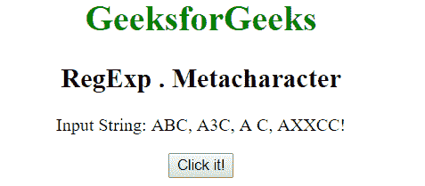
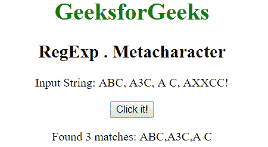
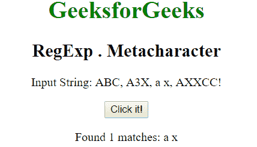

# JavaScript | RegExp。元字符

> 原文:[https://www . geesforgeks . org/JavaScript-regexp-meta character/](https://www.geeksforgeeks.org/javascript-regexp-metacharacter/)

**正则表达式。JavaScript 中的元字符**用于搜索单个字符，除了行结束符或换行符。

**语法:**

```
/regexp./ 
```

或者

```
new RegExp("regexp.")
```

**带修饰符的语法:**

```
/regexp./g 
```

或者

```
new RegExp("regexp.", "g")
```

**示例 1:** 本示例搜索起始字符为“A”而结束字符为“C”的单词，中间只有一个字符。

```
<!DOCTYPE html>
<html>

<head>
    <title>
        JavaScript RegExp . Metacharacter
    </title>
</head>

<body style="text-align:center">

    <h1 style="color:green">
        GeeksforGeeks
    </h1>

    <h2>RegExp . Metacharacter</h2>

    <p>
        Input String: ABC, A3C, A C, AXXCC!
    </p>

    <button onclick="geek()">
        Click it!
    </button>

    <p id="app"></p>

    <script>
        function geek() {
            var str1 = "ABC, A3C, A C, AXXCC!";
            var regex4 = /A.C/g;
            var match4 = str1.match(regex4);

            document.getElementById("app").innerHTML =
                        "Found " + match4.length
                        + " matches: " + match4;
        }
    </script>
</body>

</html>                    
```

**输出:**
**点击按钮前:**

**点击按钮后:**


**示例 2:** 本示例搜索以“a”作为起始字母，以“c”作为结束字母，中间只有一个字符的单词。

```
<!DOCTYPE html>
<html>

<head>
    <title>
        JavaScript RegExp . Metacharacter
    </title>
</head>

<body style="text-align:center">

    <h1 style="color:green">
        GeeksforGeeks
    </h1>

    <h2>RegExp . Metacharacter</h2>

    <p>
        Input String: ABC, A3X, a x, AXXCC!
    </p>

    <button onclick="geek()">
        Click it!
    </button>

    <p id="app"></p>

    <script>
        function geek() {
            var str1 = "ABC, A3X, a x, AXXCC!";         
            var regex4 = new RegExp("a.x", "g");
            var match4 = str1.match(regex4);

            document.getElementById("app").innerHTML =
                        "Found " + match4.length
                        + " matches: " + match4;
        }
    </script>
</body>

</html>                    
```

**输出:**
**点击按钮前:**

**点击按钮后:**


**支持的浏览器:**T2 RegExp 支持的浏览器。元字符如下所示:

*   谷歌 Chrome
*   苹果 Safari
*   Mozilla Firefox
*   歌剧
*   微软公司出品的 web 浏览器