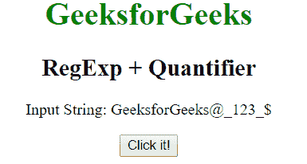
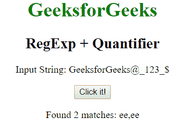
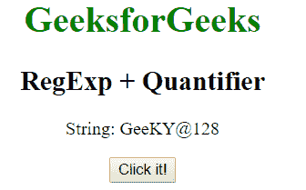
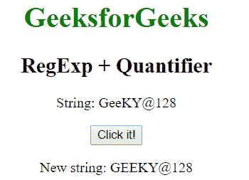

# JavaScript | RegExp +数量词

> 原文:[https://www . geesforgeks . org/JavaScript-regexp-量词-2/](https://www.geeksforgeeks.org/javascript-regexp-quantifier-2/)

JavaScript 中的 **m+量词**用于查找任何至少包含一个 m 的字符串的匹配。

**语法:**

```
/m+/ 
```

或者

```
new RegExp("m+")
```

**带修饰符的语法:**

```
/\m+/g 
```

或者

```
new RegExp("m+", "g")
```

**示例 1:** 此示例匹配整个字符串中单词“e”的存在。

```
<!DOCTYPE html>
<html>

<head>
    <title>
        JavaScript RegExp + Quantifier
    </title>
</head>

<body style="text-align:center">

    <h1 style="color:green">
        GeeksforGeeks
    </h1>

    <h2>RegExp + Quantifier</h2>

    <p>Input String: GeeksforGeeks@_123_{content}lt;/p>

    <button onclick="geek()">
        Click it!
    </button>

    <p id="app"></p>

    <script>
        function geek() {
            var str1 = "GeeksforGeeks@_123_{content}quot;;
            var regex4 = /e+/gi;
            var match4 = str1.match(regex4);

            document.getElementById("app").innerHTML
                    = "Found " + match4.length
                    + " matches: " + match4;
        }
    </script>
</body>

</html>                    
```

**输出:**
**点击按钮前:**

**点击按钮后:**


**示例 2:** 本示例将单词“ee”替换为“EE”。

```
<!DOCTYPE html>
<html>

<head>
    <title>
        JavaScript RegExp + Quantifier
    </title>
</head>

<body style="text-align:center">

    <h1 style="color:green">
        GeeksforGeeks
    </h1>

    <h2>RegExp + Quantifier</h2>

    <p>String: GeeKY@128</p>

    <button onclick="geek()">
        Click it!
    </button>

    <p id="app"></p>

    <script>
        function geek() {
            var str1 = "GeeKY@128";
            var regex4 = new RegExp("e+", "gi");         
            var replace = "EE";
            var match4 = str1.replace(regex4, replace);
            document.getElementById("app").innerHTML
                = " New string: " + match4;
        }
    </script>
</body>

</html>                    
```

**输出:**
**点击按钮前:**

**点击按钮后:**


**支持的浏览器:****RegExp+量词**支持的浏览器如下:

*   谷歌 Chrome
*   苹果 Safari
*   Mozilla Firefox
*   歌剧
*   微软公司出品的 web 浏览器