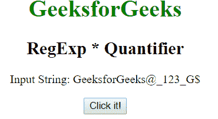
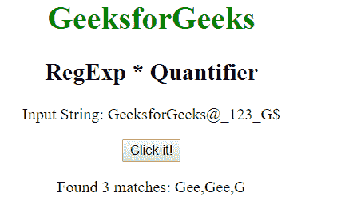
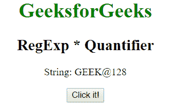
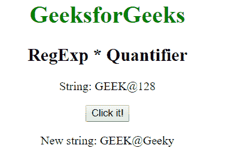

# JavaScript | RegExp *量化

> 原文:[https://www . geesforgeks . org/JavaScript-regexp-量词-3/](https://www.geeksforgeeks.org/javascript-regexp-quantifier-3/)

JavaScript 中的 **RegExp m*量词**用于查找任何包含零个或多个 m 的匹配字符串。

**语法:**

```
/m*/ 
```

或者

```
new RegExp("m*")
```

**带修饰符的语法:**

```
/\m*/g 
```

或者

```
new RegExp("m*", "g")
```

**示例 1:** 本示例匹配单词“e”在整个字符串中的零次或多次出现。

```
<!DOCTYPE html>
<html>

<head>
    <title>
        JavaScript RegExp * Quantifier
    </title>
</head>

<body style="text-align:center">

    <h1 style="color:green">
        GeeksforGeeks
    </h1>

    <h2>RegExp * Quantifier</h2>

    <p>Input String: GeeksforGeeks@_123_G{content}lt;/p>

    <button onclick="geek()">
        Click it!
    </button>

    <p id="app"></p>

    <script>
        function geek() {
            var str1 = "GeeksforGeeks@_123_G{content}quot;;
            var regex4 = /Ge*/gi;
            var match4 = str1.match(regex4);

            document.getElementById("app").innerHTML
                    = "Found " + match4.length
                    + " matches: " + match4;
        }
    </script>
</body>

</html>                    
```

**输出:**
**点击按钮前:**

**点击按钮后:**


**示例 2:** 本示例将 128*的出现替换为单词“Geeky”。

```
<!DOCTYPE html>
<html>

<head>
    <title>
        JavaScript RegExp * Quantifier
    </title>
</head>

<body style="text-align:center">

    <h1 style="color:green">
        GeeksforGeeks
    </h1>

    <h2>RegExp * Quantifier</h2>

    <p>String: GEEK@128</p>

    <button onclick="geek()">
        Click it!
    </button>

    <p id="app"></p>

    <script>
        function geek() {
            var str1 = "GEEK@128";
            var regex4 = new RegExp("128*", "gi");         
            var replace = "Geeky";
            var match4 = str1.replace(regex4, replace);

            document.getElementById("app").innerHTML
                    = " New string: " + match4;
        }
    </script>
</body>

</html>                    
```

**输出:**
**点击按钮前:**

**点击按钮后:**


**支持的浏览器:****正则表达式*量词**支持的浏览器如下:

*   谷歌 Chrome
*   苹果 Safari
*   Mozilla Firefox
*   歌剧
*   微软公司出品的 web 浏览器