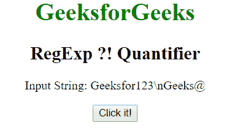
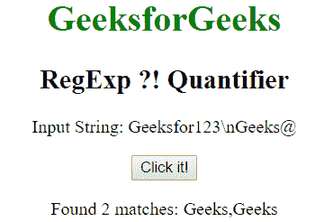
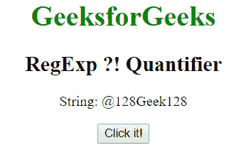
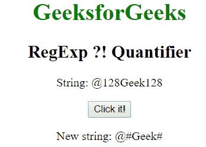

# JavaScript | RegExp？！量化〔t1〕

> 原文:[https://www . geesforgeks . org/JavaScript-regexp-量词-4/](https://www.geeksforgeeks.org/javascript-regexp-quantifier-4/)

**正则表达式？！JavaScript 中的 m 量词**用于查找任何没有后跟特定字符串 m 的字符串的匹配。

**语法:**

```
/?!m/ 
```

或者

```
new RegExp("?!m")
```

**带修饰符的语法:**

```
/\?!m/g 
```

或者

```
new RegExp("?!m", "g")
```

**示例 1:** 此示例匹配整个字符串中没有后跟 123 的单词“Geeks”。

```
<!DOCTYPE html>
<html>

<head>
    <title>
        JavaScript RegExp ?! Quantifier
    </title>
</head>

<body style="text-align:center">

    <h1 style="color:green">GeeksforGeeks</h1>

    <h2>RegExp ?! Quantifier</h2>

    <p>Input String: Geeksfor123\nGeeks@</p>

    <button onclick="geek()">Click it!</button>

    <p id="app"></p>

    <script>
        function geek() {
            var str1 = "Geeks for 123 Geeks@";
            var regex4 = /Geeks(?!123)/g;
            var match4 = str1.match(regex4);

            document.getElementById("app").innerHTML
                    = "Found " + match4.length
                    + " matches: " + match4;
        }
    </script>
</body>

</html>                    
```

**输出:**
**点击按钮前:**

**点击按钮后:**


**示例 2:** 本示例将单词“128”替换为“#”。

```
<!DOCTYPE html>
<html>

<head>
    <title>
        JavaScript RegExp ?! Quantifier
    </title>
</head>

<body style="text-align:center">

    <h1 style="color:green">GeeksforGeeks</h1>

    <h2>RegExp ?! Quantifier</h2>

    <p>String: @128Geek128</p>

    <button onclick="geek()">Click it!</button>

    <p id="app"></p>

    <script>
        function geek() {
            var str1 = "@128Geek128";
            var regex4 = new RegExp("128(?!ee)", "gi");         
            var replace = "#";
            var match4 = str1.replace(regex4, replace);
            document.getElementById("app").innerHTML = 
                " New string: " + match4;
        }
    </script>
</body>

</html>                    
```

**输出:**
**点击按钮前:**

**点击按钮后:**


**支持的浏览器:**T2 RegExp 支持的浏览器？！量词如下:

*   谷歌 Chrome
*   苹果 Safari
*   Mozilla Firefox
*   歌剧
*   微软公司出品的 web 浏览器