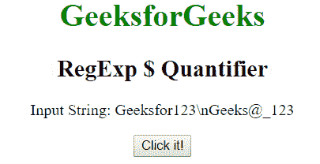
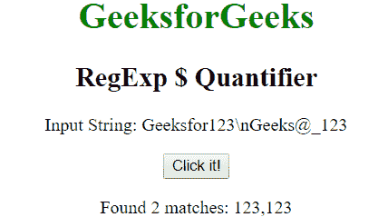
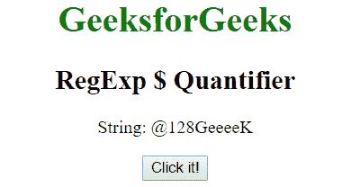
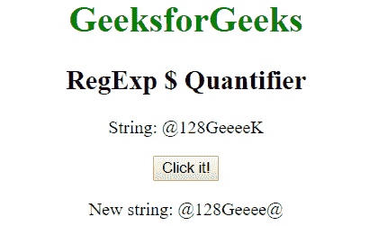

# JavaScript | regexp $ quantize

> 原文:[https://www . geesforgeks . org/JavaScript-regexp-量词-6/](https://www.geeksforgeeks.org/javascript-regexp-quantifier-6/)

JavaScript 中的 **RegExp m$量词**用于查找任何末尾包含 m 的字符串的匹配。

**语法:**

```
/m$/ 
```

或者

```
new RegExp("m{content}quot;)
```

**带修饰符的语法:**

```
/\m$/g 
```

或者

```
new RegExp("m{content}quot;, "g")
```

**示例 1:** 该示例匹配字符串末尾的单词“123”的存在。

```
<!DOCTYPE html>
<html>

<head>
    <title>
        JavaScript RegExp $ Quantifier
    </title>
</head>

<body style="text-align:center">

    <h1 style="color:green">GeeksforGeeks</h1>

    <h2>RegExp $ Quantifier</h2>

    <p>Input String: Geeksfor123\nGeeks@_123</p>

    <button onclick="geek()">Click it!</button>

    <p id="app"></p>

    <script>
        function geek() {
           var str1 = "Geeksfor123\nGeeks@_123";
            var regex4 = /123$/gim;
            var match4 = str1.match(regex4);

            document.getElementById("app").innerHTML
                    = "Found " + match4.length
                    + " matches: " +  match4;
        }
    </script>
</body>

</html>
```

**输出:**
**点击按钮前:**

**点击按钮后:**


**示例 2:** 本示例将单词“K”替换为“@”。

```
<!DOCTYPE html>
<html>

<head>
    <title>
        JavaScript RegExp $ Quantifier
    </title>
</head>

<body style="text-align:center">

    <h1 style="color:green">GeeksforGeeks</h1>

    <h2>RegExp $ Quantifier</h2>

    <p>String: @128GeeeeK</p>

    <button onclick="geek()">Click it!</button>

    <p id="app"></p>

    <script>
        function geek() {
            var str1 = "@128GeeeeK";
            var regex4 = new RegExp("K{content}quot;, "gi");         
            var replace = "@";
            var match4 = str1.replace(regex4, replace);
            document.getElementById("app").innerHTML = 
                " New string: " + match4;
        }
    </script>
</body>

</html>                    
```

**输出:**
**点击按钮前:**

**点击按钮后:**


**支持的浏览器:**下面列出了 **RegExp $量词**支持的浏览器:

*   谷歌 Chrome
*   苹果 Safari
*   Mozilla Firefox
*   歌剧
*   微软公司出品的 web 浏览器