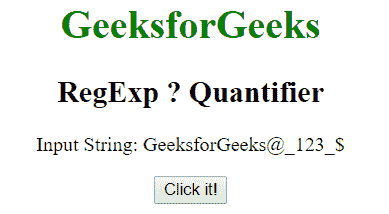
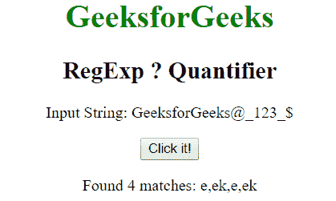
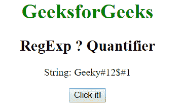
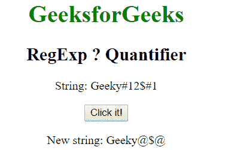

# JavaScript | RegExp？量化〔t1〕

> 原文:[https://www.geeksforgeeks.org/javascript-regexp-quantifier/](https://www.geeksforgeeks.org/javascript-regexp-quantifier/)

**米？JavaScript 中的量词**用于查找任何包含零个或一个 m 出现的字符串的匹配。

**语法:**

```
/m?/ 
```

或者

```
new RegExp("m?")
```

**带修饰符的语法:**

```
/\m?/g 
```

或者

```
new RegExp("m?", "g")
```

**示例 1:** 本示例匹配单词 e，后面跟零或一次出现的 k

```
<!DOCTYPE html>
<html>

<head>
    <title>
        JavaScript RegExp ? Quantifier
    </title>
</head>

<body style="text-align:center">

    <h1 style="color:green">
        GeeksforGeeks
    </h1>

    <h2>RegExp ? Quantifier</h2>

    <p>Input String: GeeksforGeeks@_123_{content}lt;/p>

    <button onclick="geek()">
        Click it!
    </button>

    <p id="app"></p>

    <script>
        function geek() {
            var str1 = "GeeksforGeeks@_123_{content}quot;;
            var regex4 = /ek?/gi;
            var match4 = str1.match(regex4);

            document.getElementById("app").innerHTML
                    = "Found " + match4.length
                    + " matches: " + match4;
        }
    </script>
</body>

</html>                    
```

**输出:**
**点击按钮前:**

**点击按钮后:**


**示例 2:** 本示例用“@”替换单词 1，后面跟零或一次出现的 2。

```
<!DOCTYPE html>
<html>

<head>
    <title>
        JavaScript RegExp ? Quantifier
    </title>
</head>

<body style="text-align:center">

    <h1 style="color:green">
        GeeksforGeeks
    </h1>

    <h2>RegExp ? Quantifier</h2>

    <p>String: Geeky#12$#1</p>

    <button onclick="geek()">
        Click it!
    </button>

    <p id="app"></p>

    <script>
        function geek() {
            var str1 = "Geeky#12$#1";
            var regex4 = new RegExp("#12?", "gi");         
            var replace = "@";
            var match4 = str1.replace(regex4, replace);
            document.getElementById("app").innerHTML = 
                " New string: " + match4;
        }
    </script>
</body>

</html>                    
```

**输出:**
**点击按钮前:**

**点击按钮后:**


**支持的浏览器:**T2 RegExp 支持的浏览器？量词如下:

*   谷歌 Chrome
*   苹果 Safari
*   Mozilla Firefox
*   歌剧
*   微软公司出品的 web 浏览器