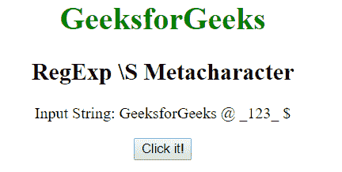
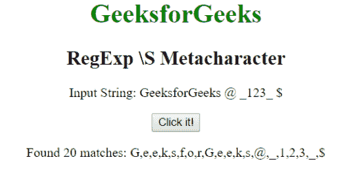
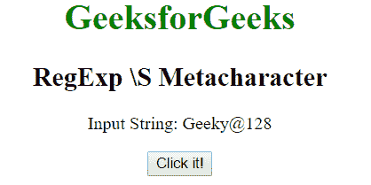
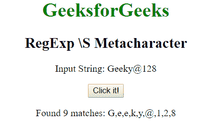

# JavaScript | RegExp \S 元字符

> 原文:[https://www . geesforgeks . org/JavaScript-regexp-s-meta character-2/](https://www.geeksforgeeks.org/javascript-regexp-s-metacharacter-2/)

JavaScript 中的 **RegExp \S 元字符**用于查找非空白字符。空白字符可以是空格/制表符/新行/垂直字符。这和^\t\n\r].一样

**语法:**

```
/\S/ 
```

或者

```
new RegExp("\\S")
```

**带修饰符的语法:**

```
/\S/g 
```

或者

```
new RegExp("\\S", "g")
```

**示例 1:** 本示例匹配非空白字符。

```
<!DOCTYPE html>
<html>

<head>
    <title>
        JavaScript RegExp \S Metacharacter
    </title>
</head>

<body style="text-align:center">

    <h1 style="color:green">
        GeeksforGeeks
    </h1>

    <h2>RegExp \S Metacharacter</h2>

    <p>
        Input String: GeeksforGeeks @ _123_ $
    </p>

    <button onclick="geek()">
        Click it!
    </button>
    <p id="app"></p>

    <script>
        function geek() {
            var str1 = "GeeksforGeeks @ _123_ {content}quot;;
            var regex4 = /\S/g;
            var match4 = str1.match(regex4);

            document.getElementById("app").innerHTML = 
                    "Found " + match4.length
                    + " matches: " + match4;
        }
    </script>
</body>

</html>                    
```

**输出:**
**点击按钮前:**

**点击按钮后:**


**示例 2:** 本示例匹配非空白字符。

```
<!DOCTYPE html>
<html>

<head>
    <title>
        JavaScript RegExp \S Metacharacter
    </title>
</head>

<body style="text-align:center">

    <h1 style="color:green">
        GeeksforGeeks
    </h1>

    <h2>RegExp \S Metacharacter</h2>

    <p>Input String: Geeky@128</p>

    <button onclick="geek()">
        Click it!
    </button>

    <p id="app"></p>

    <script>
        function geek() {
        var str1 = "Geeky@128";         
            var regex4 = new RegExp("\\S", "g");

            var match4 = str1.match(regex4);

            document.getElementById("app").innerHTML = 
                    "Found " + match4.length
                    + " matches: " + match4;
        }
    </script>
</body>

</html>                    
```

**输出:**
**点击按钮前:**

**点击按钮后:**


**支持的浏览器:**下面列出了 **RegExp \S 元字符**支持的浏览器:

*   谷歌 Chrome
*   苹果 Safari
*   Mozilla Firefox
*   歌剧
*   微软公司出品的 web 浏览器