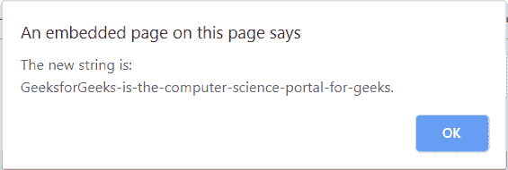
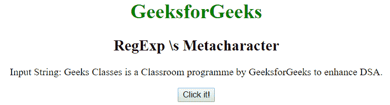
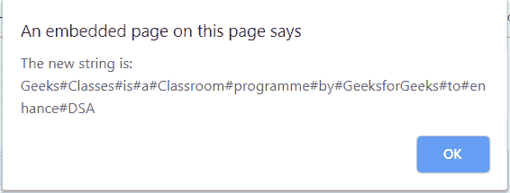

# JavaScript | RegExp \s 元字符

> 原文:[https://www . geesforgeks . org/JavaScript-regexp-s-meta character/](https://www.geeksforgeeks.org/javascript-regexp-s-metacharacter/)

JavaScript 中的**正则表达式元字符**用于查找空白字符。空白字符可以是空格/制表符/新行/垂直字符。它与[ \t\n\r]相同。
**语法:**

```
/\s/ 
```

或者

```
new RegExp("\\s")
```

**带修饰语的语法:**

```
/\s/g 
```

或者

```
new RegExp("\\s", "g")
```

**示例 1:** 本示例将空格替换为破折号。

## 超文本标记语言

```
<!DOCTYPE html>
<html>

<head>
    <title>
        JavaScript RegExp \s Metacharacter
    </title>
</head>

<body style="text-align:center">

    <h1 style="color:green">
        GeeksforGeeks
    </h1>

    <h2>RegExp \s Metacharacter</h2>

<p>
        Input String: GeeksforGeeks is the computer
        science\nportal\tfor geeks.
    </p>

    <button onclick="geek()">
        Click it!
    </button>

    <p id="app"></p>

    <script>
        function geek() {
            var regex = /\s/g;
            var replace = "-";
            var str = "GeeksforGeeks is the computer "
                    + "science\nportal\tfor geeks.";
            var str1 = str.replace(regex, replace);
            alert("The new string is: \n" + str1);
        }
    </script>
</body>

</html>                   
```

**输出:**
**点击按钮前:**


**点击按钮后:**



**示例 2:** 本示例用哈希(#)替换所有空格。

## 超文本标记语言

```
<!DOCTYPE html>
<html>

<head>
    <title>
        JavaScript RegExp \s Metacharacter
    </title>
</head>

<body style="text-align:center">

    <h1 style="color:green">
        GeeksforGeeks
    </h1>

    <h2>RegExp \s Metacharacter</h2>

<p>
        Input String: Geeks Classes is a Classroom
        programme by GeeksforGeeks to enhance DSA.
    </p>

    <button onclick="geek()">
        Click it!
    </button>

    <p id="app"></p>

    <script>
        function geek() {
            var regex = new RegExp("\\s", "g");
            var replace = "#";
            var str = "Geeks Classes is a Classroom "
                    + "programme\nby GeeksforGeeks\tto"
                    + " enhance DSA";
            var str1 = str.replace(regex, replace);
            alert("The new string is: \n" + str1);
        }
    </script>
</body>

</html>                   
```

**输出:**
**点击按钮前:**



**点击按钮后:**



**支持的浏览器:**T2 正则表达式元字符支持的浏览器如下:

*   谷歌 Chrome
*   苹果 Safari
*   Mozilla Firefox
*   歌剧
*   微软公司出品的 web 浏览器