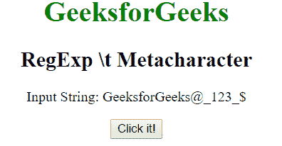
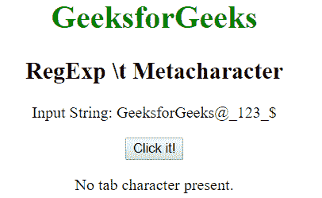
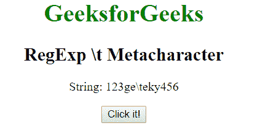
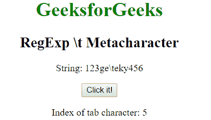

# JavaScript | RegExp \t 元字符

> 原文:[https://www . geesforgeks . org/JavaScript-regexp-t-meta character/](https://www.geeksforgeeks.org/javascript-regexp-t-metacharacter/)

JavaScript 中的 **RegExp \t 元字符**用于查找制表符。如果找到，它返回位置，否则返回-1。

**语法:**

```
/\t/ 
```

或者

```
new RegExp("\\t")
```

**示例 1:** 本示例搜索字符串中的制表符。

```
<!DOCTYPE html>
<html>

<head>
    <title>
        JavaScript RegExp \t Metacharacter
    </title>
</head>

<body style="text-align:center">

    <h1 style="color:green">
        GeeksforGeeks
    </h1>

    <h2>RegExp \t Metacharacter</h2>

    <p>Input String: GeeksforGeeks@_123_{content}lt;/p>

    <button onclick="geek()">
        Click it!
    </button>

    <p id="app"></p>

    <script>
        function geek() {
            var str1 = "GeeksforGeeks@_123_{content}quot;;
            var regex4 = /\t/;
            var match4 = str1.search(regex4);
            if(match4 == -1) {         
                document.getElementById("app").innerHTML
                = "No tab character present. ";
            } else {
                document.getElementById("app").innerHTML
                = "Index of tab character: " + match4;
            }
        }
    </script>
</body>

</html>                    
```

**输出:**
**点击按钮前:**

**点击按钮后:**


**示例 2:** 本示例搜索制表符在字符串中的位置。

```
<!DOCTYPE html>
<html>

<head>
    <title>
        JavaScript RegExp \t Metacharacter
    </title>
</head>

<body style="text-align:center">

    <h1 style="color:green">
        GeeksforGeeks
    </h1>

    <h2>RegExp \t Metacharacter</h2>

    <p>String: 123ge\teky456</p>

    <button onclick="geek()">
        Click it!
    </button>

    <p id="app"></p>

    <script>
        function geek() {
            var str1 = "123ge\teky456";
            var regex4 = new RegExp("\\t");         
            var match4 = str1.search(regex4);

            document.getElementById("app").innerHTML
            = " Index of tab character: " + match4;
        }
    </script>
</body>

</html>                    
```

**输出:**
**点击按钮前:**

**点击按钮后:**


**支持的浏览器:**以下列出了 **RegExp \t 元字符**支持的浏览器:

*   谷歌 Chrome
*   苹果 Safari
*   Mozilla Firefox
*   歌剧
*   微软公司出品的 web 浏览器