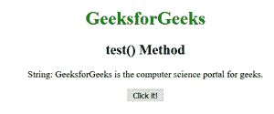
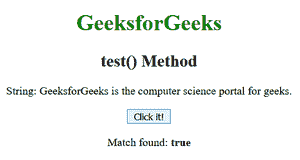
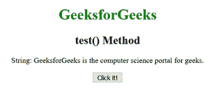
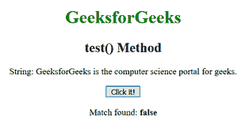

# JavaScript | RegExp test()方法

> 原文:[https://www . geesforgeks . org/JavaScript-regexp-test-method/](https://www.geeksforgeeks.org/javascript-regexp-test-method/)

JavaScript 中的**正则表达式测试()方法**用于测试字符串中的匹配。如果匹配，该方法返回**真**否则返回**假**。
**语法:**

```
RegExpObject.test(str)
```

其中**字符串**是要搜索的字符串。这是必填字段。
**示例 1:** 本示例在原始字符串中搜索字符串“计算机”。

## 超文本标记语言

```
<!DOCTYPE html>
<html>

<head>
    <title>
        JavaScript RegExp test() Method
    </title>
</head>

<body style="text-align:center">

    <h1 style="color:green">
        GeeksforGeeks
    </h1>

    <h2>test() Method</h2>

<p>
        String: GeeksforGeeks is the
        computer science portal for geeks.
    </p>

    <button onclick="geek()">
        Click it!
    </button>

    <p id="app"></p>

    <script>
        function geek() {
            var str="GeeksforGeeks is the computer science"
                   + " portal for geeks.";
            var regex = new RegExp("computer", );
            var rex = regex.test(str);

            document.getElementById("app").innerHTML
                    = " Match " + " found: " + "<b>"
                    + rex + "</b>";
        }
    </script>
</body>

</html>                   
```

**输出:**
**点击按钮前:**



**点击按钮后:**



**示例 2:** 本示例在原始字符串中搜索字符串“GEEK”。

## 超文本标记语言

```
<!DOCTYPE html>
<html>

<head>
    <title>
        JavaScript RegExp test() Method
    </title>
</head>

<body style="text-align:center">

    <h1 style="color:green">
        GeeksforGeeks
    </h1>

    <h2>test() Method</h2>

<p>
        String: GeeksforGeeks is the
        computer science portal for geeks.
    </p>

    <button onclick="geek()">
        Click it!
    </button>

    <p id="app"></p>

    <script>
        function geek() {
            var str="GeeksforGeeks is the computer science"
                    + " portal for geeks.";
            var regex = new RegExp("GEEK", );
            var rex = regex.test(str);

            document.getElementById("app").innerHTML
                    = " Match " + " found: "
                    + "<b>" + rex + "</b>";
        }
    </script>
</body>

</html>                   
```

**输出:**
**点击按钮前:**



**点击按钮后:**



**支持的浏览器:**以下列出 **RegExp test()方法**支持的浏览器:

*   谷歌 Chrome
*   苹果 Safari
*   Mozilla Firefox
*   歌剧
*   微软公司出品的 web 浏览器