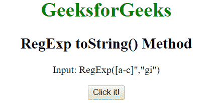
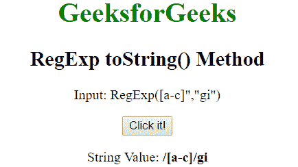
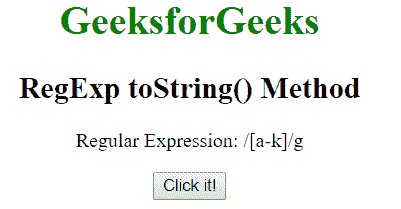
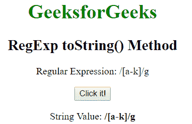

# JavaScript | RegExp toString()方法

> 原文:[https://www . geesforgeks . org/JavaScript-regexp-tostring-method/](https://www.geeksforgeeks.org/javascript-regexp-tostring-method/)

JavaScript 中的 **RegExp toString()方法**用于返回正则表达式的字符串值。
**语法:**

```
RegExpObject.toString()
```

**示例 1:** 本示例返回正则表达式的字符串值。

## 超文本标记语言

```
<!DOCTYPE html>
<html>

<head>
    <title>
        JavaScript RegExp toString Method
    </title>
</head>

<body style="text-align:center">

    <h1 style="color:green">GeeksforGeeks</h1>

    <h2>RegExp toString() Method</h2>

<p>Input: RegExp([a-c]", "gi")</p>

    <button onclick="geek()">Click it!</button>

    <p id="app"></p>

    <script>
        function geek() {
            var regex = new RegExp("[a-c]", "gi");
            var rex = regex.toString();
            document.getElementById("app").innerHTML =
            "String Value: " + "<b>" + rex + "</b>";
        }
    </script>
</body>

</html>                   
```

**输出:**
**点击按钮前:**



**点击按钮后:**



**示例 2:** 本示例返回正则表达式的字符串值。

## 超文本标记语言

```
<!DOCTYPE html>
<html>

<head>
    <title>
        JavaScript RegExp toString Method
    </title>
</head>

<body style="text-align:center">

    <h1 style="color:green">GeeksforGeeks</h1>

    <h2>RegExp toString() Method</h2>

<p>Regular Expression: /[a-k]/g</p>

    <button onclick="geek()">Click it!</button>

    <p id="app"></p>

    <script>
        function geek() {
            var regex = /[a-k]/g;
            var rex = regex.toString();
            document.getElementById("app").innerHTML =
            "String Value: " + "<b>" + rex + "</b>";
        }
    </script>
</body>

</html>                   
```

**输出:**
**点击按钮前:**



**点击按钮后:**



**支持的浏览器:**下面列出了 **RegExp toString()方法**支持的浏览器:

*   谷歌 Chrome 1 及以上版本
*   边缘 12 及以上
*   Firefox 1 及以上版本
*   Internet Explorer 4 及以上版本
*   歌剧 5 及以上
*   Safari 1 及以上