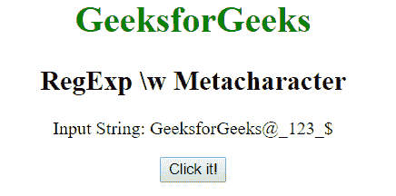
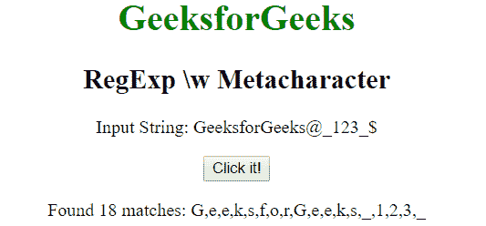
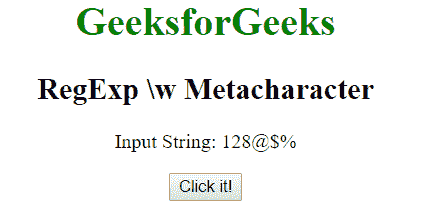

# JavaScript | RegExp \w 元字符

> 原文:[https://www . geesforgeks . org/JavaScript-regexp-w-meta character-2/](https://www.geeksforgeeks.org/javascript-regexp-w-metacharacter-2/)

JavaScript 中的 **RegExp \w 元字符**用于查找单词字符，即从 A 到 Z、A 到 Z、0 到 9 的字符。与[a-zA-Z_0-9]相同。

**语法:**

```
/\w/ 
```

或者

```
new RegExp("\\w")
```

**带修饰符的语法:**

```
/\w/g 
```

或者

```
new RegExp("\\w", "g")
```

**示例 1:** 本示例搜索小写字符、大写字符和下划线。

```
<!DOCTYPE html>
<html>

<head>
    <title>
        JavaScript RegExp \w Metacharacter
    </title>
</head>

<body style="text-align:center">

    <h1 style="color:green">
        GeeksforGeeks
    </h1>

    <h2>RegExp \w Metacharacter</h2>

    <p>Input String: GeeksforGeeks@_123_{content}lt;/p>

    <button onclick="geek()">
        Click it!
    </button>

    <p id="app"></p>

    <script>
        function geek() {
            var str1 = "GeeksforGeeks@_123_{content}quot;;
            var regex4 = /\w/g;
            var match4 = str1.match(regex4);

            document.getElementById("app").innerHTML = 
                        "Found " + match4.length
                        + " matches: " + match4;
        }
    </script>
</body>

</html>                    
```

**输出:**
**点击按钮前:**

**点击按钮后:**


**示例 2:** 本示例搜索小写字符、大写字符和下划线，并用哈希(#)替换它们。

```
<!DOCTYPE html>
<html>

<head>
    <title>
        JavaScript RegExp \w Metacharacter
    </title>
</head>

<body style="text-align:center">

    <h1 style="color:green">
        GeeksforGeeks
    </h1>

    <h2>RegExp \w Metacharacter</h2>

    <p>Input String: 128@$%</p>

    <button onclick="geek()">
        Click it!
    </button>

    <p id="app"></p>

    <script>
        function geek() {
            var str1 = "128@$%";         
            var replacement = "#";
            var regex4 = new RegExp("\\w", "g");
            var match4 = str1.replace(regex4, replacement);

            document.getElementById("app").innerHTML =
                    "Found " + match4.length
                    + " matches: " + match4;
        }
    </script>
</body>

</html>                    
```

**输出:**
**点击按钮前:**

**点击按钮后:**


**支持的浏览器:**以下列出了 **RegExp \w 元字符**支持的浏览器:

*   谷歌 Chrome
*   苹果 Safari
*   Mozilla Firefox
*   歌剧
*   微软公司出品的 web 浏览器